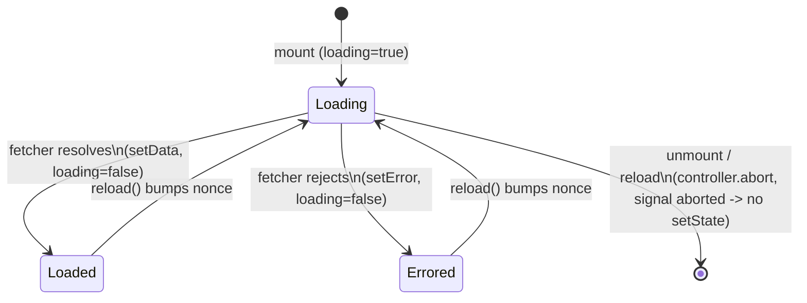

<!-- structure:aaf1c65c6b62 -->

**File:** `src/lib/useFetch.ts` · **Lines:** 47

<!-- fill:file:summary -->
This module provides `useFetch`, a small generic React hook that runs an async `fetcher` on mount and exposes its `loading`/`error`/`data` state plus a `reload` callback, along with the `FetchState<T>` interface describing that shape. It wraps each call in an `AbortController` so in-flight requests are cancelled on unmount or reload, avoiding stale state updates. `PipelinesPanel.tsx` is the consumer, pairing it with `fetchPipelines` from `api.ts` to load pipeline data declaratively.
<!-- /fill:file:summary -->

## Imports

This file pulls in the following modules. Relative imports point to other documented files; external imports are libraries from `node_modules`.

| Module | Imports | Kind |
| --- | --- | --- |
| `react` | `useCallback`, `useEffect`, `useState` | external |


## Symbols

This file exports 2 symbols. Every export is documented below, in declaration order.

| Name | Kind | Default |
| --- | --- | --- |
| useFetch | hook | no |
| FetchState | interface | no |

## useFetch

**Kind:** `hook`

```ts
export function useFetch<T>(
  fetcher: (signal: AbortSignal) => Promise<T>,
): FetchState<T> { ... }
```

> Run an async fetcher on mount and expose loading/error/data state.
> The `fetcher` must be referentially stable (e.g. a module-level function),
> otherwise the effect re-runs every render.

### Parameters

| Name | Type | Default | Required | Purpose |
| --- | --- | --- | --- | --- |
| fetcher | `(signal: AbortSignal) => Promise<T>` | — | yes | <FILL: purpose of fetcher> |

**Returns:** `FetchState<T>`

<!-- fill:sym:useFetch:return -->
A `FetchState<T>` object: `data` is the resolved result or `null` until the first success, `loading` is `true` while a request is in flight, `error` is the failure message string or `null`, and `reload` re-runs the fetcher. `data` stays `null` on error, and `error` is cleared (`null`) at the start of each new attempt. Note `data` is not reset to `null` on reload, so a previous result remains visible while the next request loads.
<!-- /fill:sym:useFetch:return -->

### Line-by-line walkthrough

Each top-level statement of `useFetch`, in execution order. The line numbers reference the source file as it appears today.

**Line 18 — `FirstStatement`**

```ts
const [data, setData] = useState<T | null>(null)
```

<!-- fill:sym:useFetch:walk:0 -->
Declares the `data` state, typed `T | null` and initialized to `null` because no result exists before the first fetch resolves. `setData` is called once the fetcher succeeds.
<!-- /fill:sym:useFetch:walk:0 -->

**Line 19 — `FirstStatement`**

```ts
const [loading, setLoading] = useState(true)
```

<!-- fill:sym:useFetch:walk:1 -->
Declares the `loading` boolean state, initialized to `true` so the very first render already reflects the pending request that the mount effect is about to start — avoiding a flash of "no data" before loading begins.
<!-- /fill:sym:useFetch:walk:1 -->

**Line 20 — `FirstStatement`**

```ts
const [error, setError] = useState<string | null>(null)
```

<!-- fill:sym:useFetch:walk:2 -->
Declares the `error` state, typed `string | null` and initialized to `null` (no error yet). On failure it holds the error message; the effect resets it to `null` at the start of each attempt so a prior error never lingers across a successful reload.
<!-- /fill:sym:useFetch:walk:2 -->

**Line 21 — `FirstStatement`**

```ts
const [nonce, setNonce] = useState(0)
```

<!-- fill:sym:useFetch:walk:3 -->
Declares a `nonce` counter, initialized to `0`. Its only purpose is to act as an effect dependency: incrementing it forces the fetch effect to re-run, which is how `reload` triggers a refetch without changing the `fetcher` reference.
<!-- /fill:sym:useFetch:walk:3 -->

**Line 23 — `FirstStatement`**

```ts
const reload = useCallback(() => setNonce((n) => n + 1), [])
```

<!-- fill:sym:useFetch:walk:4 -->
Defines `reload` as a `useCallback` with an empty dependency array, so the function identity is stable across renders. It bumps `nonce` via the functional updater `(n) => n + 1`, which retriggers the fetch effect. Memoizing it means consumers can safely pass `reload` to children or include it in their own deps without causing re-renders.
<!-- /fill:sym:useFetch:walk:4 -->

**Line 25 — `ExpressionStatement`**

```ts
useEffect(() => {
    const controller = new AbortController()
    setLoading(true)
    setError(null)

    fetcher(controller.signal)
      .then((result) => {
        if (controller.signal.aborted) return
        setData(result)
        setLoading(false)
      })
      .catch((err: unknown) => {
        if (controller.signal.aborted) return
        setError(err instanceof Error ? err.message : 'Request failed')
        setLoading(false)
      })

    return () => controller.abort()
  }, [fetcher, nonce])
```

<!-- fill:sym:useFetch:walk:5 -->
The core effect. On each run it creates a fresh `AbortController`, flips `loading` to `true`, and clears any prior `error`. It then invokes `fetcher(controller.signal)`; on success it sets `data` and clears `loading`, on failure it stores the error message (`err.message` when `err` is an `Error`, else `'Request failed'`) and clears `loading`. Both handlers first check `controller.signal.aborted` and bail out early, so a cancelled request never writes stale state into an unmounted or superseded component. The cleanup function returned (`() => controller.abort()`) aborts the in-flight request whenever the effect re-runs or the component unmounts. The dependency array `[fetcher, nonce]` re-runs the effect when the fetcher reference changes or `reload` bumps `nonce` — which is why the docstring warns the fetcher must be referentially stable.
<!-- /fill:sym:useFetch:walk:5 -->

**Line 45 — `ReturnStatement`**

```ts
return { data, loading, error, reload }
```

<!-- fill:sym:useFetch:walk:6 -->
Returns the current `FetchState<T>` — the live `data`, `loading`, and `error` values plus the stable `reload` callback — so the consuming component can render the appropriate loading/error/data UI and trigger a refetch.
<!-- /fill:sym:useFetch:walk:6 -->

### Examples

<!-- fill:sym:useFetch:example -->
Pair it with the module-level `fetchPipelines` (a stable reference) from `api.ts`:

```tsx
function PipelinesPanel() {
  const { data, loading, error, reload } = useFetch(fetchPipelines)

  if (loading) return <Spinner />
  if (error) return <button onClick={reload}>Retry ({error})</button>
  return <PipelineList pipelines={data!.pipelines} />
}
```

On mount `loading` is `true` and `data` is `null`; once `fetchPipelines` resolves, `data` holds the `PipelinesResponse` and `loading` becomes `false`. Calling `reload()` refetches.
<!-- /fill:sym:useFetch:example -->

### Used by

- `src/components/PipelinesPanel.tsx`

## FetchState

**Kind:** `interface`

```ts
export interface FetchState<T> { ... }
```

<!-- fill:sym:FetchState:summary -->
`FetchState<T>` is the return type of `useFetch`. It bundles the four pieces of async state a component needs — the resolved `data` (or `null`), a `loading` flag, an `error` message (or `null`), and a `reload` trigger — into one object so callers can destructure exactly what they render. The generic `T` flows through from the fetcher's resolved type.
<!-- /fill:sym:FetchState:summary -->

### Shape

| Name | Type | Description |
| --- | --- | --- |
| data | `T` | <FILL: data> |
| loading | `boolean` | <FILL: loading> |
| error | `string` | <FILL: error> |
| reload | `() => void` | <FILL: reload> |

## Diagrams

<!-- fill:file:diagrams -->

<!-- /fill:file:diagrams -->
