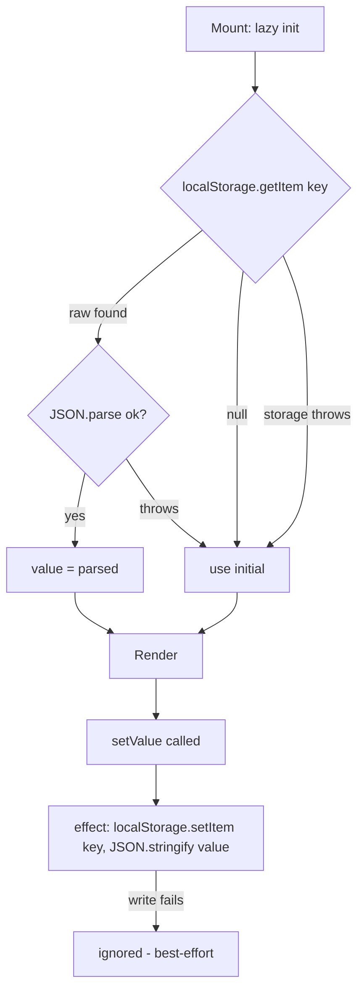

<!-- structure:acbc64a702c2 -->

**File:** `src/lib/usePersistentState.ts` · **Lines:** 31

<!-- fill:file:summary -->
This module provides `usePersistentState`, a generic React hook that behaves like `useState` but mirrors the value to `localStorage` under a given key and restores it on the next mount. All storage access is wrapped in try/catch so disabled storage, quota errors, or malformed JSON fall back to the `initial` value rather than throwing. `AgentGrid.tsx` uses it to remember UI preferences (such as the selected sort or filter) across page reloads.
<!-- /fill:file:summary -->

## Imports

This file pulls in the following modules. Relative imports point to other documented files; external imports are libraries from `node_modules`.

| Module | Imports | Kind |
| --- | --- | --- |
| `react` | `useEffect`, `useState` | external |


## Symbols

This file exports 1 symbol. Every export is documented below, in declaration order.

| Name | Kind | Default |
| --- | --- | --- |
| usePersistentState | hook | no |

## usePersistentState

**Kind:** `hook`

```ts
export function usePersistentState<T>(
  key: string,
  initial: T,
): [T, (value: T) => void] { ... }
```

> Like useState, but the value is mirrored to localStorage under `key` and
> restored on the next mount. Storage failures (disabled storage, quota,
> malformed JSON) fall back to `initial` rather than throwing.

### Parameters

| Name | Type | Default | Required | Purpose |
| --- | --- | --- | --- | --- |
| key | `string` | — | yes | The `localStorage` key used for both the initial read and subsequent writes; pick a stable, app-scoped string (e.g. `'snabbit.agentGrid.sort'`). |
| initial | `T` | — | yes | Value returned when no stored value exists or when reading/parsing fails; effectively the default for first-time visitors. |

**Returns:** `[T, (value: T) => void]`

<!-- fill:sym:usePersistentState:return -->
A `[value, setValue]` tuple matching the `useState` convention: `value` is the current state (the restored stored value, or `initial` if nothing was stored or reading failed), and `setValue` updates it, triggering a re-render and a write back to `localStorage`. The tuple itself is never `null`; `value` is only `null`/`undefined` if `T` permits those.
<!-- /fill:sym:usePersistentState:return -->

### Line-by-line walkthrough

Each top-level statement of `usePersistentState`, in execution order. The line numbers reference the source file as it appears today.

**Line 12 — `FirstStatement`**

```ts
const [value, setValue] = useState<T>(() => {
    try {
      const raw = localStorage.getItem(key)
      return raw !== null ? (JSON.parse(raw) as T) : initial
    } catch {
      return initial
    }
  })
```

<!-- fill:sym:usePersistentState:walk:0 -->
Initializes state with a lazy initializer function, so the `localStorage` read runs only once (on first render) rather than on every render. It reads the raw string at `key`; when present it `JSON.parse`s it back into a `T`, otherwise it returns `initial`. The whole read is wrapped in try/catch so a `SecurityError` (storage disabled) or a `JSON.parse` failure on malformed data falls back to `initial` instead of crashing the component.
<!-- /fill:sym:usePersistentState:walk:0 -->

**Line 21 — `ExpressionStatement`**

```ts
useEffect(() => {
    try {
      localStorage.setItem(key, JSON.stringify(value))
    } catch {
      // Ignore write failures — persistence is best-effort.
    }
  }, [key, value])
```

<!-- fill:sym:usePersistentState:walk:1 -->
A `useEffect` that synchronizes the value back to storage. Whenever `value` (or `key`) changes it serializes the value with `JSON.stringify` and writes it to `localStorage`. The try/catch swallows write failures (e.g. quota exceeded, private-mode storage) because persistence is best-effort — a failed write must not break the UI. The `[key, value]` deps ensure the write fires on every value change and re-targets if the key changes.
<!-- /fill:sym:usePersistentState:walk:1 -->

**Line 29 — `ReturnStatement`**

```ts
return [value, setValue]
```

<!-- fill:sym:usePersistentState:walk:2 -->
Returns the `[value, setValue]` tuple so the hook is a drop-in replacement for `useState`. `setValue` is React's own state setter; calling it updates `value`, which re-renders and triggers the persistence effect above.
<!-- /fill:sym:usePersistentState:walk:2 -->

### Examples

<!-- fill:sym:usePersistentState:example -->
Remember the selected sort key across reloads:

```tsx
const [sort, setSort] = usePersistentState<SortKey>('agentSort', 'runs')

// First mount with nothing stored → sort === 'runs'
setSort('name')        // re-renders; writes "name" to localStorage['agentSort']
// After a page reload → sort === 'name' (restored from storage)
```
<!-- /fill:sym:usePersistentState:example -->

### Used by

- `src/components/AgentGrid.tsx`

## Diagrams

<!-- fill:file:diagrams -->

<!-- /fill:file:diagrams -->
