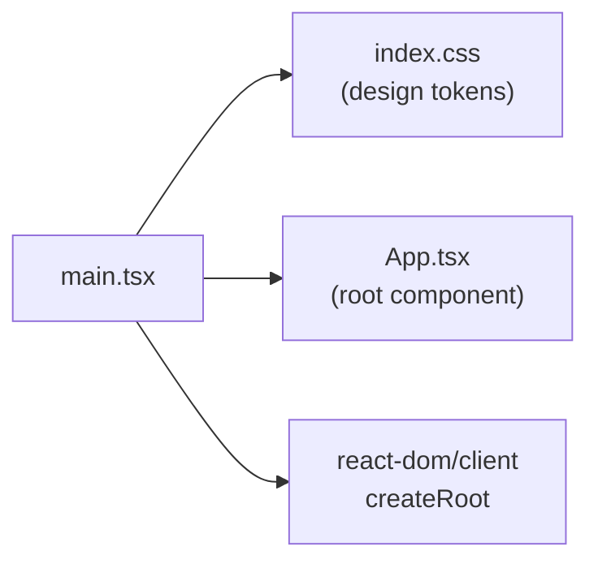

**File:** `src/main.tsx`

The browser-side entry point. Creates the React root and renders the application
tree inside React's `StrictMode`.

## Full source

```tsx
import { StrictMode } from 'react'
import { createRoot } from 'react-dom/client'
import './index.css'
import App from './App.tsx'

createRoot(document.getElementById('root')!).render(
  <StrictMode>
    <App />
  </StrictMode>,
)
```

## Line-by-line walkthrough

### CSS import

```ts
import './index.css'
```

Vite processes this as a CSS module side-effect. `index.css` is the sole
CSS entry point — it declares the Tailwind v4 import and all design tokens.
Importing it here ensures styles are bundled and applied before first render.

### Root creation

```ts
createRoot(document.getElementById('root')!)
```

`createRoot` is the React 18+ API for concurrent-mode rendering. The non-null
assertion `!` is safe because `index.html` always contains `<div id="root"></div>`.
If for any reason the element were missing, `createRoot` would throw at startup
rather than silently producing a blank page.

### StrictMode

```tsx
<StrictMode>
  <App />
</StrictMode>
```

`StrictMode` activates React's development-time safety checks:

- **Double-invocation** of function components, state initializers, and effects
  in development to surface side-effect bugs (e.g., effects that should be
  idempotent but are not).
- **Deprecation warnings** for unsafe lifecycle methods and legacy APIs.

`StrictMode` has no runtime effect in production builds — it is compiled out.
The double-invocation is why `useFetch`'s abort-controller guard
(`if (controller.signal.aborted) return`) is important: in development, the
effect runs twice, the first controller is immediately aborted, and the guard
prevents the aborted result from overwriting state.

## Module graph



## Used by

`index.html` loads this file as the Vite entry point:

```html
<script type="module" src="/src/main.tsx"></script>
```

At build time (`npm run build`), Vite bundles `main.tsx` and all its transitive
imports into the output `dist/` directory.
