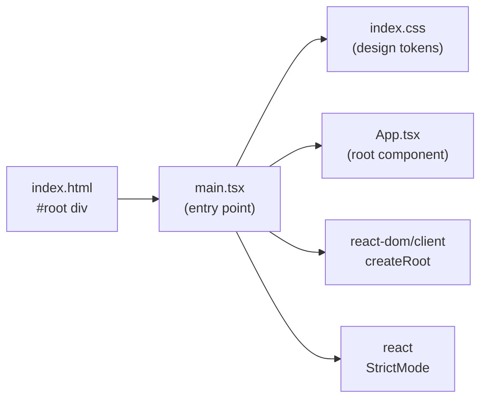

**File:** `src/main.tsx`

The browser-side entry point. Creates the React root and renders the entire application tree inside React's `StrictMode`.

## Full source

```tsx
import { StrictMode } from 'react'
import { createRoot } from 'react-dom/client'
import './index.css'
import App from './App.tsx'

createRoot(document.getElementById('root')!).render(
  <StrictMode>
    <App />
  </StrictMode>,
)
```

## Line-by-line walkthrough

### React imports

```ts
import { StrictMode } from 'react'
import { createRoot } from 'react-dom/client'
```

- `StrictMode` — a React component that enables development-time safety checks (see below).
- `createRoot` — the React 18+ concurrent-mode API for mounting a React tree into a DOM node. Replaces the legacy `ReactDOM.render`.

### CSS side-effect import

```ts
import './index.css'
```

Vite processes this as a CSS side-effect import. `index.css` is the sole CSS entry point for the application — it declares the Tailwind v4 `@import` and all design tokens via `@theme`. Importing it here ensures styles are bundled and applied to the page before the first React render.

### Root creation

```ts
createRoot(document.getElementById('root')!)
```

`document.getElementById('root')` queries the `<div id="root"></div>` element declared in `index.html`. The non-null assertion (`!`) is safe: `index.html` always provides this element, and the module script that loads `main.tsx` is placed at the bottom of `<body>`, guaranteeing the element exists in the DOM when this line runs.

If the element were somehow absent, `createRoot` would throw a clear error at startup rather than silently producing a blank page — making the failure immediately visible during development.

`createRoot` returns a `Root` object whose `.render()` method is called immediately in the same expression.

### StrictMode

```tsx
.render(
  <StrictMode>
    <App />
  </StrictMode>,
)
```

`StrictMode` wraps the entire component tree. Its effects are development-only — it is compiled out in production builds and adds zero runtime overhead in production.

In development, `StrictMode` activates:

- **Double-invocation** of function component bodies, state initializer functions, and `useEffect` / `useLayoutEffect` / `useMemo` / `useReducer` callbacks. React runs each twice (discarding the first result) to surface side-effect bugs — for example, effects that produce incorrect results when not properly idempotent.
- **Deprecation warnings** for unsafe lifecycle methods and legacy React APIs (e.g. `findDOMNode`, legacy context).
- **State preservation warnings** — React warns if you accidentally rely on state that should have been reset.

#### StrictMode and `useFetch`

The double-invocation is why the `AbortController` guard in `useFetch` matters:

```ts
useEffect(() => {
  const controller = new AbortController()
  // ...
  fetcher(controller.signal).then((result) => {
    if (controller.signal.aborted) return   // <- this guard
    setData(result)
    setLoading(false)
  })
  return () => controller.abort()
}, [fetcher, nonce])
```

In development (with `StrictMode`), React mounts the component, runs the effect, immediately unmounts it (triggering the cleanup which calls `controller.abort()`), then remounts and runs the effect again. The `signal.aborted` guard ensures that the result from the first (aborted) fetch is discarded rather than setting state after unmount.

## The DOM anchor — `index.html`

`index.html` provides the mount point:

```html
<div id="root"></div>
```

And loads this file as the Vite entry point:

```html
<script type="module" src="/src/main.tsx"></script>
```

At build time (`npm run build`), Vite replaces this script tag with the hashed, minified bundle and inlines critical CSS into the output `dist/index.html`.

## Module graph



## Used by

`index.html` — the only file that references `main.tsx`. No other source file imports it.
