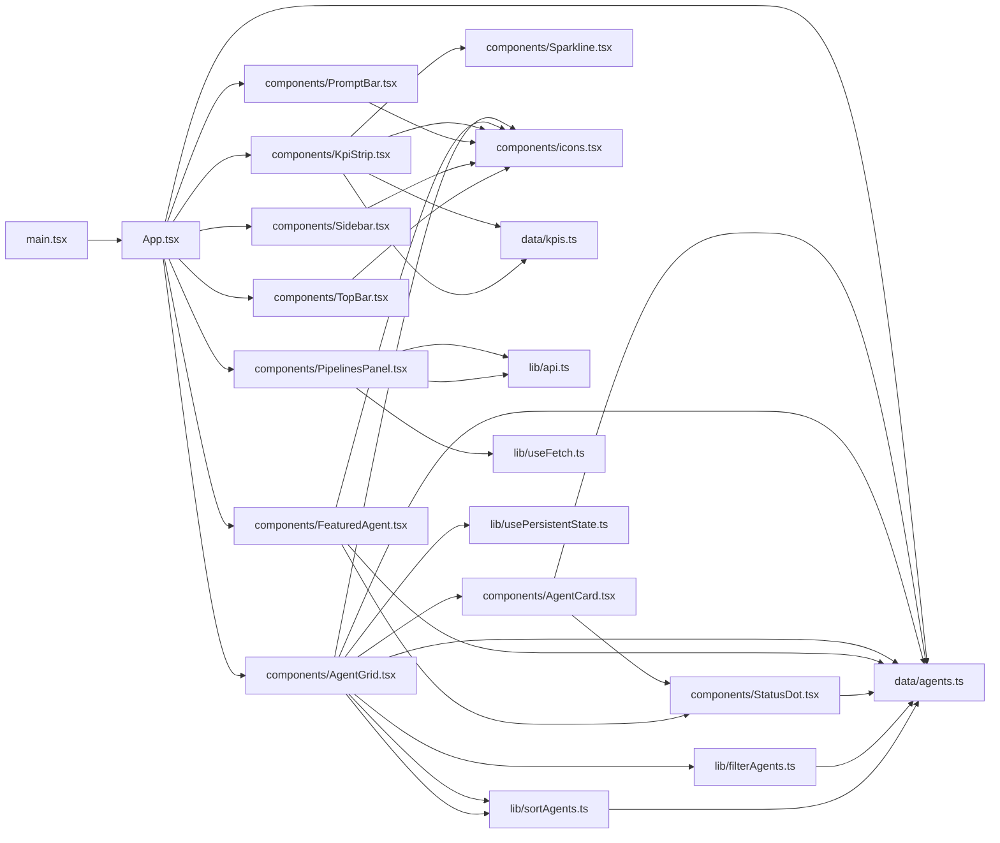
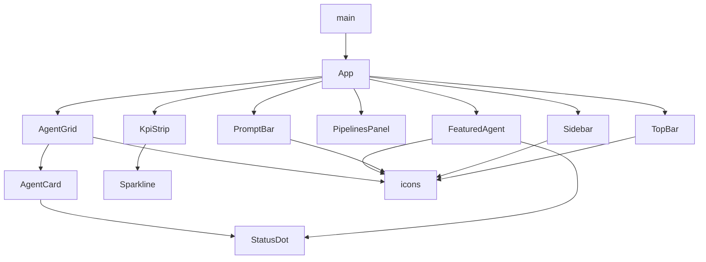

**Section root:** `src`

> React + Vite single-page application. Renders the Agent Console dashboard.

<!-- fill:overview:summary -->
The frontend is a React + Vite single-page app that renders the Snabbit Agent Console dashboard. It owns everything in the browser: the layout shell and components (`src/components/`), the UI logic and hooks (`src/lib/`), and the static seed data and types (`src/data/`). As the **Module dependency graph** shows, `main.tsx` boots `App.tsx`, which composes the page-level sections; the **React component tree** shows that tree of parent-renders-child relationships. The only runtime data crossing the network boundary is the CI/CD pipeline list, fetched from the backend via `lib/api.ts`; agents and KPIs are currently sourced from `src/data/` rather than the API.
<!-- /fill:overview:summary -->

## Top-level structure

| Folder | Purpose |
| --- | --- |
| [`components/`](./frontend/components/overview/) | React UI components, from page sections to leaf primitives; add a file here when you need new rendered markup. |
| [`data/`](./frontend/data/overview/) | Static seed data and its TypeScript types; add a file here for fixture/catalogue data, not logic. |
| [`lib/`](./frontend/lib/overview/) | Presentation-free logic — the API client, pure transforms, and hooks; add a file here for reusable non-UI behavior. |
| [`test/`](./frontend/test/overview/) | Vitest/RTL test setup (e.g. jest-dom matchers); add a file here for global test configuration, not individual specs. |

### Files at the root of this section

| File | Hint |
| --- | --- |
| [`App.tsx`](./app) | Root component composing the layout shell; splits the featured agent from the rest and renders all page sections. |
| [`main.tsx`](./main) | Vite entrypoint that mounts `App` into `#root` inside `StrictMode` and loads the global stylesheet. |

## Architecture

### Module dependency graph

### React component tree

## Key flows

<!-- fill:overview:flows -->
- **Boot:** [`main.tsx`](./main) creates the React root and renders [`App.tsx`](./app), which derives the featured agent and the remainder from [`data/agents.ts`](./data/agents) and lays out the sidebar, top bar, content sections, and prompt bar.
- **Browse agents:** [`AgentGrid`](./components/agentgrid) pipes its `agents` through [`filterAgents`](./lib/filteragents) then [`sortAgents`](./lib/sortagents), persists the tab/sort via [`usePersistentState`](./lib/usepersistentstate), and renders an [`AgentCard`](./components/agentcard) per match.
- **Live pipelines:** [`PipelinesPanel`](./components/pipelinespanel) loads [`fetchPipelines`](./lib/api) through [`useFetch`](./lib/usefetch), rendering loading/error/empty/list states and refetching on Refresh.
<!-- /fill:overview:flows -->

## When to add code here

<!-- fill:overview:when-to-add -->
Add code here when it runs in the browser and shapes the dashboard UI. Put rendered markup in `components/`, reusable non-visual logic (transforms, hooks, the typed API client) in `lib/`, and fixture/catalogue data with its types in `data/`. If the work is server-side — REST endpoints, the database, or CI/CD integrations — it belongs in the backend (`server/`) instead, and the docs assistant Worker lives in `chat-worker/`. When you need real server data, extend `lib/api.ts` rather than adding another `fetch` call inside a component.
<!-- /fill:overview:when-to-add -->
