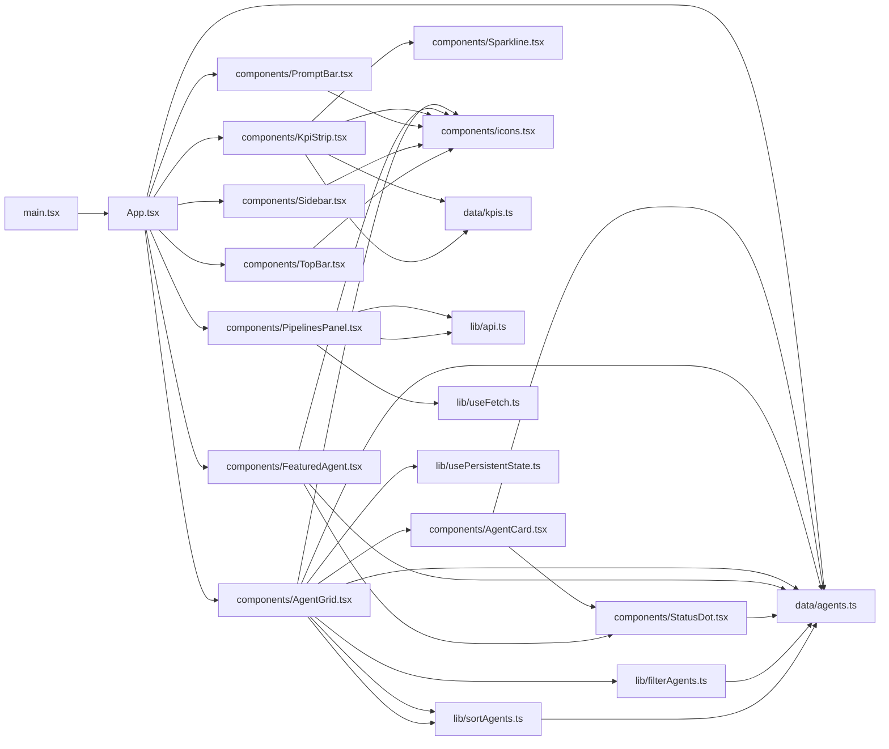
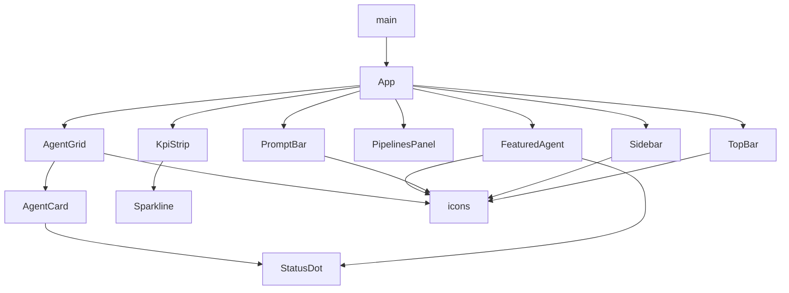

**Section root:** `src`

> React + Vite single-page application. Renders the Agent Console dashboard.

<!-- fill:overview:summary -->
The `src` subsystem is the React + Vite single-page application that renders the Snabbit Agent Console dashboard in the browser. `main.tsx` mounts the root `App.tsx`, which composes the entire UI from the `components/` layer; those components draw their content from the static seed data in `data/` and their logic from the pure helpers and hooks in `lib/`. As the **Module dependency graph** above shows, data and logic flow inward toward the components, and the **React component tree** shows how `App` nests them at runtime. The only data crossing a real runtime boundary is the CI/CD pipeline feed: `lib/api.ts` fetches it from the backend API (default `http://localhost:3001`), while agents and KPIs are currently hard-coded client-side. The `test/` folder holds the shared Vitest setup rather than application code.
<!-- /fill:overview:summary -->

## Top-level structure

| Folder | Purpose |
| --- | --- |
| [`components/`](./frontend/components/overview/) | React presentation components; add a file here when you need new UI markup. |
| [`data/`](./frontend/data/overview/) | Static seed data and its types; add a file here for a new hard-coded dataset. |
| [`lib/`](./frontend/lib/overview/) | Pure helpers, the API client, and reusable hooks; add a file here for logic or state, not markup. |
| [`test/`](./frontend/test/overview/) | Shared Vitest test setup; add a file here only for global test configuration. |

### Files at the root of this section

| File | Hint |
| --- | --- |
| [`App.tsx`](./app) | Root component that lays out the console shell and composes every top-level widget. |
| [`main.tsx`](./main) | Entry point that mounts `App` into the DOM root inside React `StrictMode`. |

## Architecture

### Module dependency graph

### React component tree

## Key flows

<!-- fill:overview:flows -->
- **Bootstrap:** [`main.tsx`](./main) calls `createRoot(...).render(<App />)`, and [`App.tsx`](./app) splits `AGENTS` from [`data/agents.ts`](./frontend/data/agents/) into the featured agent and the rest, then renders the sidebar/topbar shell around the content widgets.
- **Agent browsing:** [`AgentGrid`](./frontend/components/agentgrid/) pipes its agents through [`filterAgents`](./frontend/lib/filteragents/) then [`sortAgents`](./frontend/lib/sortagents/), persisting the active tab and sort via [`usePersistentState`](./frontend/lib/usepersistentstate/), and renders each result as an [`AgentCard`](./frontend/components/agentcard/).
- **Live pipelines:** [`PipelinesPanel`](./frontend/components/pipelinespanel/) calls [`useFetch`](./frontend/lib/usefetch/) with `fetchPipelines` from [`api.ts`](./frontend/lib/api/), which performs the one real network request to the backend and feeds the panel's loading/error/data states.
<!-- /fill:overview:flows -->

## When to add code here

<!-- fill:overview:when-to-add -->
Add code here when it runs in the browser as part of the dashboard UI. New visual elements go in `components/`; pure data transforms, the API client, or reusable hooks go in `lib/`; hard-coded seed datasets go in `data/`. If the work is server-side request handling, persistence, or a CI/CD integration, it belongs in the `server/` backend instead; if it answers documentation questions, it belongs in the `chat-worker/`. As a rule of thumb, anything that produces HTTP responses or talks to a database is out of scope for this subsystem — this layer only consumes that data over `fetch`.
<!-- /fill:overview:when-to-add -->
