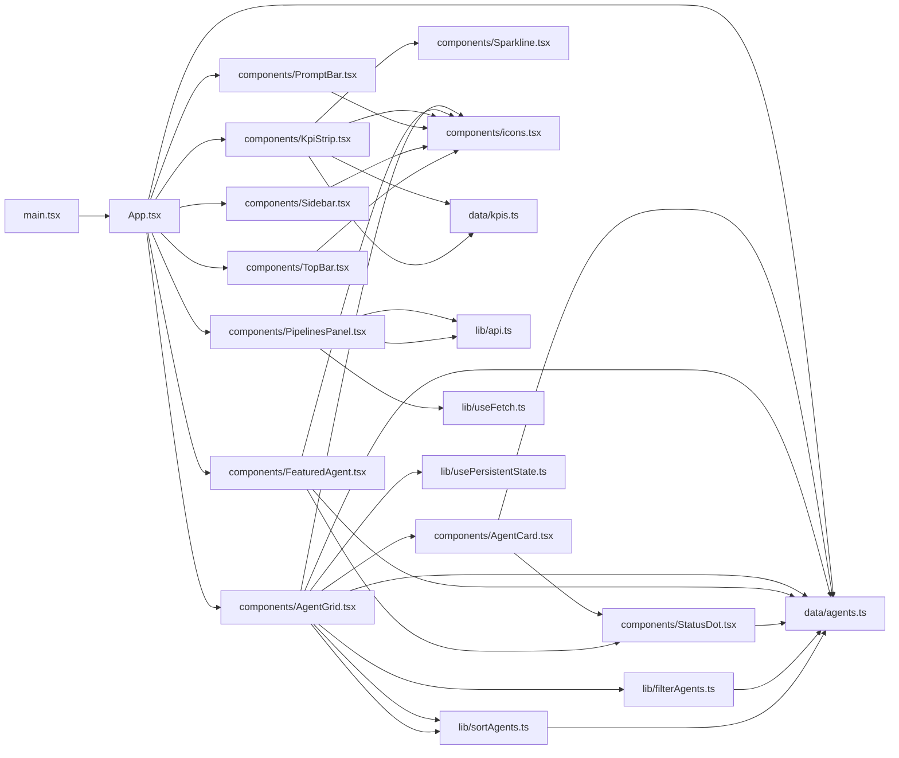
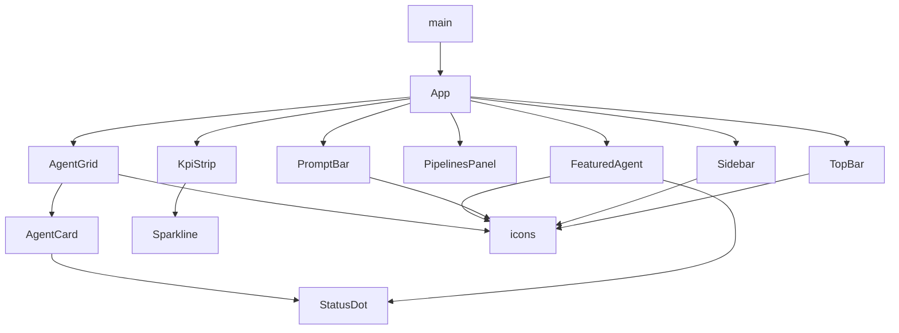

**Section root:** `src`

> React + Vite single-page application. Renders the Agent Console dashboard.

<!-- fill:overview:summary -->
The `src` subsystem is the React + Vite single-page application that renders the Agent Console dashboard. `main.tsx` is the bootstrap that mounts the root [`App.tsx`](./app) into the DOM under `StrictMode`; `App.tsx` then composes the whole page from the components in `components/`. As shown in the Module dependency graph below, the UI reads static seed data from `data/` (the agent catalogue and KPI series) and shapes it through helpers and hooks in `lib/` (filtering, sorting, persisted state, and fetching). The only live external boundary is `lib/api.ts`, which `PipelinesPanel` uses to fetch CI/CD pipeline data from the backend (default `http://localhost:3001`); everything else is rendered from local data. The React component tree diagram below shows the runtime parent-child structure rooted at `App`, with `AgentGrid` as the primary interactive surface.
<!-- /fill:overview:summary -->

## Top-level structure

| Folder | Purpose |
| --- | --- |
| [`components/`](./frontend/components/overview/) | React UI components (chrome, dashboard widgets, reusable blocks); add a file here when introducing a new rendered piece of the UI. |
| [`data/`](./frontend/data/overview/) | Static seed data and its types (agent catalogue, KPI series); add a file here for fixed dashboard data that a real backend would eventually supply. |
| [`lib/`](./frontend/lib/overview/) | Framework-agnostic helpers and hooks (filtering, sorting, `useFetch`, `usePersistentState`, the typed API client); add a file here for pure logic or reusable hooks, not UI. |
| [`test/`](./frontend/test/overview/) | Vitest setup (`setup.ts`); add shared test configuration here rather than per-component test files. |

### Files at the root of this section

| File | Hint |
| --- | --- |
| [`App.tsx`](./app) | Root component; lays out the console shell and composes Sidebar, TopBar, KpiStrip, FeaturedAgent, PipelinesPanel, AgentGrid, and PromptBar. |
| [`main.tsx`](./main) | Entry point; mounts `App` into `#root` under `StrictMode` and imports the global stylesheet. |

## Architecture

### Module dependency graph

### React component tree

## Key flows

<!-- fill:overview:flows -->
- Startup and composition: `main.tsx` mounts [`App`](./app), which reads `AGENTS`/`FEATURED_AGENT_ID` from `data/agents`, splits out the featured agent from the `rest`, and renders the chrome plus dashboard widgets, handing `featured` to [`FeaturedAgent`](./components/featuredagent) and `rest` to [`AgentGrid`](./components/agentgrid).
- Agent browsing: [`AgentGrid`](./components/agentgrid) combines `usePersistentState` (category, sort) and local query state, pipes the agents through `filterAgents` then `sortAgents`, and renders the survivors as `AgentCard`s.
- Live pipelines: [`PipelinesPanel`](./components/pipelinespanel) calls `fetchPipelines` through `useFetch`, the one path that crosses the network boundary to the backend API, and renders loading/error/empty/list states with a Refresh control.
<!-- /fill:overview:flows -->

## When to add code here

<!-- fill:overview:when-to-add -->
Add code to `src` when it is part of the dashboard front end. Put new rendered UI in `components/`, pure logic and reusable hooks in `lib/`, and fixed seed data with its types in `data/`. Keep components thin: if a component starts doing data shaping or async orchestration, extract that into a `lib/` helper or hook (like `filterAgents`, `sortAgents`, `useFetch`) so it stays testable in isolation. Anything that talks to the backend belongs behind the typed client in `lib/api.ts` rather than calling `fetch` directly from a component. Server-side code, backend API handlers, and non-UI concerns live outside this subsystem and should not be added here.
<!-- /fill:overview:when-to-add -->
