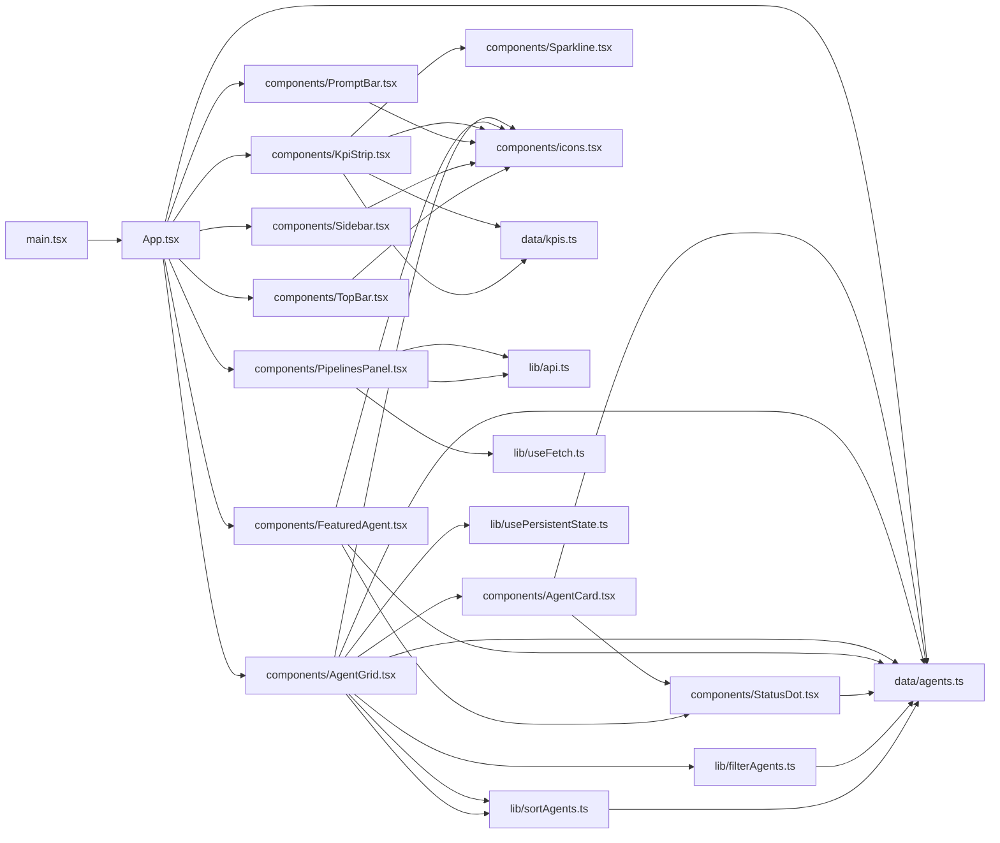
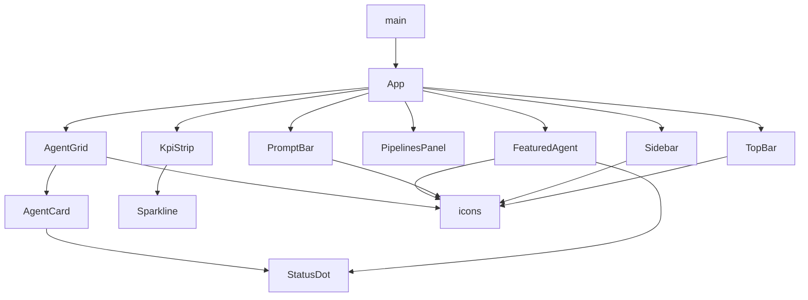

**Section root:** `src`

> React + Vite single-page application. Renders the Agent Console dashboard.

<!-- fill:overview:summary -->
The `src/` tree is a React 19 single-page app built with Vite. It owns everything the browser runs: the layout (`Sidebar`, `TopBar`, `PromptBar`), the dashboard content (`KpiStrip`, `FeaturedAgent`, `AgentGrid`, `PipelinesPanel`), the seed data for agents and KPIs, and small DOM-free utilities under `lib/` for filtering, sorting, persistent state, and fetch lifecycle. The runtime boundary is the browser: data either comes from the static `data/` modules at bundle time, or — for live pipeline status — from the Express backend via `fetch(VITE_API_URL/api/pipelines)` in `lib/api.ts`. The **Module dependency graph** below shows how files import each other, and the **React component tree** shows how `App` composes the on-screen layout.
<!-- /fill:overview:summary -->

## Top-level structure

| Folder | Purpose |
| --- | --- |
| [`components/`](./frontend/components/overview/) | React components that render the dashboard chrome and dashboard surface — add a file here when introducing a new UI block. |
| [`data/`](./frontend/data/overview/) | Static seed data (agent catalogue, KPI list) and their TypeScript types — add a file here for new bundled data that has no backend yet. |
| [`lib/`](./frontend/lib/overview/) | DOM-free helpers and reusable hooks — add a file here when logic can be unit tested without React Testing Library. |
| [`test/`](./frontend/test/overview/) | Vitest setup (`@testing-library/jest-dom`, `localStorage` reset) — add a file here only to expand the global test environment. |

### Files at the root of this section

| File | Hint |
| --- | --- |
| [`App.tsx`](./app) | Root component — composes the sidebar, top bar, KPI strip, featured agent, pipelines panel, agent grid, and prompt bar. |
| [`main.tsx`](./main) | Vite entry — creates the React root in `#root` and renders `<App />` inside `<StrictMode>`. |

## Architecture

### Module dependency graph

### React component tree

## Key flows

<!-- fill:overview:flows -->
- **Boot:** [`main.tsx`](./main) creates the React root and renders [`App`](./app), which reads `AGENTS` and `FEATURED_AGENT_ID` from [`data/agents.ts`](./frontend/data/agents/), splits the featured agent out, and renders the layout with the rest of the catalogue handed to `AgentGrid`.
- **Filter / sort agents:** [`AgentGrid`](./frontend/components/agentgrid/) tracks the category and sort in `usePersistentState` (mirrored to `localStorage`) and the query in `useState`, then derives the visible list via [`filterAgents`](./frontend/lib/filteragents/) → [`sortAgents`](./frontend/lib/sortagents/) inside a `useMemo`.
- **Pipelines fetch:** [`PipelinesPanel`](./frontend/components/pipelinespanel/) calls [`useFetch(fetchPipelines)`](./frontend/lib/usefetch/), which hits `GET /api/pipelines` on the backend; the hook tracks loading/error and exposes `reload` for the panel's Refresh button.
<!-- /fill:overview:flows -->

## When to add code here

<!-- fill:overview:when-to-add -->
Add code here when it runs in the browser. New visual blocks go in [`components/`](./frontend/components/overview/); pure helpers and hooks go in [`lib/`](./frontend/lib/overview/); bundled fixture data goes in [`data/`](./frontend/data/overview/). If the work touches Express, Postgres, or the CI/CD adapter, it belongs under [`backend`](../backend/overview/) instead. If it answers questions over the docs corpus, it belongs in [`chat-worker`](../chat-worker/overview/).
<!-- /fill:overview:when-to-add -->
