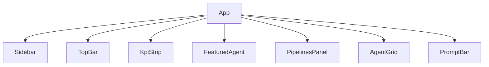

The frontend is a single-page application (SPA) built with **Vite 8**, **React 19**, **TypeScript 6**, and **Tailwind CSS v4**. It runs entirely in the browser and communicates with the backend over a single REST endpoint (`GET /api/pipelines`). All other data is static seed data bundled at build time.

## Technology stack

| Layer | Technology | Version |
|---|---|---|
| Bundler / dev server | Vite | 8 |
| UI framework | React | 19 |
| Language | TypeScript | 6 |
| Styling | Tailwind CSS | v4 |
| Unit testing | Vitest + React Testing Library | — |
| Test DOM environment | jsdom | — |

## Entry points

The application boots through a three-file chain:

```
index.html
  └── <script type="module" src="/src/main.tsx">
        └── main.tsx   (createRoot + StrictMode)
              └── App.tsx  (root component — full-page layout)
```

1. **`index.html`** — The HTML shell served by Vite. Contains the `<div id="root">` mount point, the module-script tag that loads `main.tsx`, a pink SVG favicon, and `<link rel="preconnect">` hints for loading the Geist and Geist Mono fonts from Google Fonts. Sets `class="dark"` and `color-scheme: dark` on `<html>`.
2. **`src/main.tsx`** — Bootstraps React with `createRoot` wrapped in `<StrictMode>`. See [main.tsx](./main).
3. **`src/App.tsx`** — Composes the full page layout from seven child components. Splits the agent catalogue into the featured agent and the grid. See [App.tsx](./app).

## Component tree



All components live under `src/components/`. See [Components overview](./components) for a full table and per-component reference links.

## Build tooling

Vite is configured in `vite.config.ts` with two plugins:

- **`@vitejs/plugin-react`** — Babel-based Fast Refresh and JSX transform. No need to `import React` in every file.
- **`@tailwindcss/vite`** — Processes `@import "tailwindcss"` and the `@theme` block at build time. No separate PostCSS config is required.

TypeScript compilation uses project references (`tsconfig.json` references both `tsconfig.app.json` and `tsconfig.node.json`). Application source is checked under the browser lib set; `vite.config.ts` itself is checked under the Node lib set. The `build` script runs `tsc -b` before `vite build` so that a type error fails the build before any output files are written.

## Development server

Start with:

```bash
npm run dev
```

Vite starts on **`http://localhost:5173`** by default with Hot Module Replacement (HMR) enabled. The backend must be running on `:3001` (or `VITE_API_URL`) for the Pipelines panel to load data.

### Environment variables

| Variable | Default | Purpose |
|---|---|---|
| `VITE_API_URL` | `http://localhost:3001` | Base URL for the backend REST API |

Variables must be prefixed `VITE_` to be included in the browser bundle. Variables without the prefix are stripped by Vite as a security measure. Set overrides in `.env.local` at the repository root.

## npm scripts

| Script | Command | Purpose |
|---|---|---|
| `dev` | `vite` | Start dev server with HMR on :5173 |
| `build` | `tsc -b && vite build` | Type-check then produce optimised `dist/` |
| `preview` | `vite preview` | Serve `dist/` locally to validate the production build |
| `lint` | `eslint .` | Lint all source files |
| `test` | `vitest` | Run unit tests in watch mode |
| `test:run` | `vitest run` | Single-pass test run (for CI) |
| `test:ui` | `vitest --ui` | Open the Vitest browser UI |

:::note
`tsc -b` in the `build` script runs a full TypeScript project-references build. A type error in any source file will abort the build before Vite writes any output, so `dist/` is never produced from a type-unsafe codebase.
:::

## Data flow

| Panel | Data source | Makes a network call? |
|---|---|---|
| KpiStrip | `src/data/kpis.ts` | No |
| FeaturedAgent | `src/data/agents.ts` | No |
| PipelinesPanel | `GET /api/pipelines` via `useFetch` | **Yes** |
| AgentGrid | `src/data/agents.ts` | No |

## Directory structure

```
src/
├── components/              # All React UI components
│   ├── AgentCard.tsx
│   ├── AgentGrid.tsx
│   ├── FeaturedAgent.tsx
│   ├── icons.tsx
│   ├── KpiCard.tsx
│   ├── KpiStrip.tsx
│   ├── PipelinesPanel.tsx
│   ├── PromptBar.tsx
│   ├── Sidebar.tsx
│   ├── Sparkline.tsx
│   ├── StatusDot.tsx
│   └── TopBar.tsx
├── data/
│   ├── agents.ts            # Static agent catalogue + domain types
│   └── kpis.ts              # KPI seed data + domain types
├── lib/
│   ├── api.ts               # fetchPipelines REST client
│   ├── filterAgents.ts      # Pure category + query filter
│   ├── sortAgents.ts        # Pure four-strategy sort
│   ├── useFetch.ts          # Generic data-fetching hook
│   └── usePersistentState.ts  # localStorage-backed useState
├── test/
│   └── setup.ts             # Vitest global setup (jest-dom + localStorage clear)
├── App.tsx                  # Root layout component
├── index.css                # Design tokens + Tailwind v4 base
├── main.tsx                 # React bootstrap (createRoot + StrictMode)
└── vite-env.d.ts            # ImportMeta type augmentation for VITE_API_URL
```

## Per-file reference

### Entry points

- [App.tsx](./app) — root component and dashboard layout
- [main.tsx](./main) — React root creation and mount
- [Styling — design tokens](./styling) — `index.css`, Tailwind v4 `@theme`, color and font tokens
- [vite.config.ts](./vite-config) — build and Vitest configuration
- [vite-env.d.ts](./vite-env) — TypeScript declarations for `import.meta.env`
- [test/setup.ts](./test-setup) — jest-dom matchers and localStorage isolation

### Components (`src/components/`)

See [Components overview](./components) for the full table and dependency diagram.

### Library (`src/lib/`)

See [Library overview](./lib) for a quick-reference table, or navigate directly:

- [api.ts](./lib/api) — typed HTTP client
- [filterAgents.ts](./lib/filteragents) — category + query filter
- [sortAgents.ts](./lib/sortagents) — four sort strategies
- [useFetch](./lib/usefetch) — data-fetching hook with abort and reload
- [usePersistentState](./lib/usepersistentstate) — localStorage-backed state hook

### Data (`src/data/`)

See [Data overview](./data), or navigate directly:

- [agents.ts](./data/agents) — 12-agent catalogue, types, and constants
- [kpis.ts](./data/kpis) — 4-KPI catalogue and types
