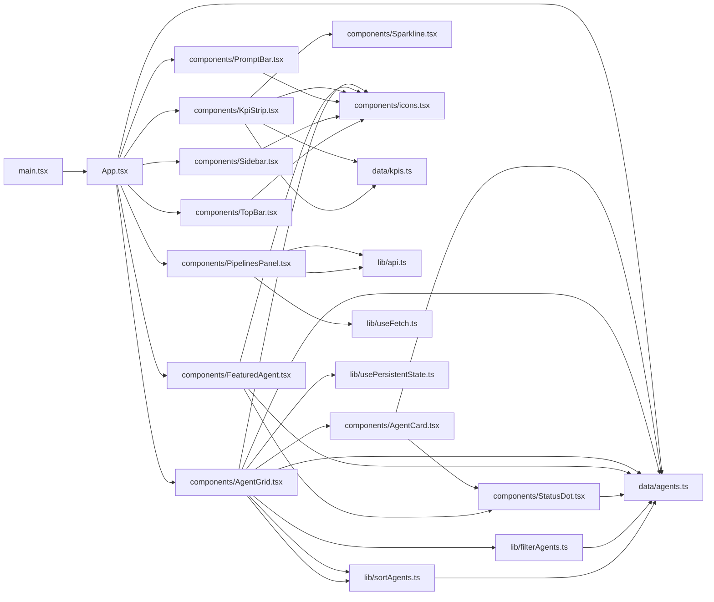
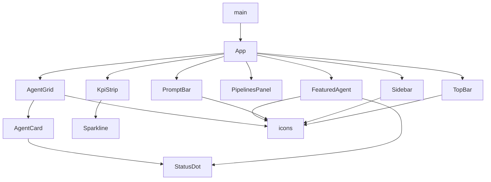

**Section root:** `src`

> React + Vite single-page application. Renders the Agent Console dashboard.

<!-- fill:overview:summary -->
The `src` subsystem is the React + Vite single-page application that renders the Agent Console dashboard. Its entrypoint `main.tsx` mounts the root `App.tsx`, which composes the page from presentational components under `components/` (Sidebar, TopBar, KpiStrip, FeaturedAgent, PipelinesPanel, AgentGrid, PromptBar) and feeds them data from `data/` (the `AGENTS` catalogue and `KPIS` metrics). Pure logic and hooks live in `lib/` — agent filtering and sorting, a `useFetch` hook, persistent state, and the `api` client that `PipelinesPanel` uses to load live data. The Module dependency graph below shows how these files import one another, and the React component tree shows the parent-renders-child hierarchy starting at `App`. The app consumes mostly static seed data, with `PipelinesPanel` being the one component that fetches live data through `lib/api.ts`.
<!-- /fill:overview:summary -->

## Top-level structure

| Folder | Purpose |
| --- | --- |
| [`components/`](./frontend/components/overview/) | Presentational React components and icons; add a file here when introducing a new piece of dashboard UI. |
| [`data/`](./frontend/data/overview/) | Static seed datasets and their types (agents, KPIs); add a file here for hard-coded data that stands in for a backend fetch. |
| [`lib/`](./frontend/lib/overview/) | Framework-agnostic logic, hooks, and the API client; add a file here for reusable pure functions or React hooks. |
| [`test/`](./frontend/test/overview/) | Vitest global test setup; add a file here for shared test configuration, not for individual test suites. |

### Files at the root of this section

| File | Hint |
| --- | --- |
| [`App.tsx`](./app) | Root component that lays out the console shell and wires every dashboard component to its data. |
| [`main.tsx`](./main) | React entrypoint that mounts `App` into `#root` inside `StrictMode`. |

## Architecture

### Module dependency graph

### React component tree

## Key flows

<!-- fill:overview:flows -->
- **Boot and compose:** [`main.tsx`](./main) creates the React root and renders [`App`](./app), which reads `AGENTS` and `FEATURED_AGENT_ID` from [`data/agents`](./data/agents), splits the featured agent from the rest, and renders the Sidebar/TopBar/KpiStrip/FeaturedAgent/PipelinesPanel/AgentGrid/PromptBar layout.
- **Browse agents:** `AgentGrid` takes the `rest` agents, applies [`filterAgents`](./lib/filteragents) and [`sortAgents`](./lib/sortagents), and persists the user's filter/sort choices via `usePersistentState`, rendering one `AgentCard` per result.
- **Live pipelines:** `PipelinesPanel` calls [`api`](./lib/api) through the [`useFetch`](./lib/usefetch) hook to load pipeline data at runtime — the one place the SPA reaches beyond static seed data.
<!-- /fill:overview:flows -->

## When to add code here

<!-- fill:overview:when-to-add -->
Add code to `src` when it is part of the browser-side dashboard. Put new visual pieces in `components/` (and reusable SVGs in `components/icons.tsx`), pure functions or React hooks in `lib/`, and hard-coded datasets or their types in `data/`. Keep server-side logic, agent execution, and integrations out of this subsystem — those belong in the backend. If a component needs live data, fetch it through `lib/api.ts` and `lib/useFetch.ts` rather than reaching out to the network directly.
<!-- /fill:overview:when-to-add -->
