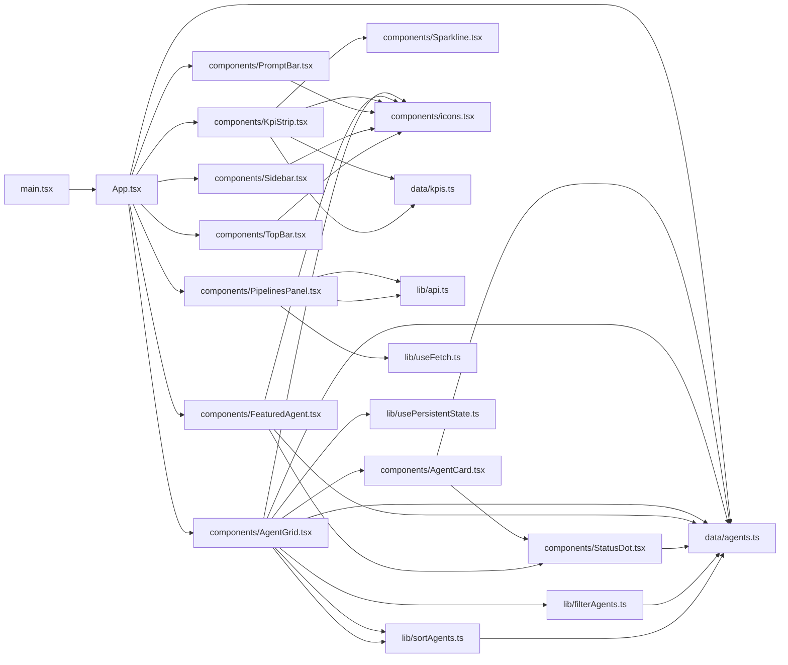
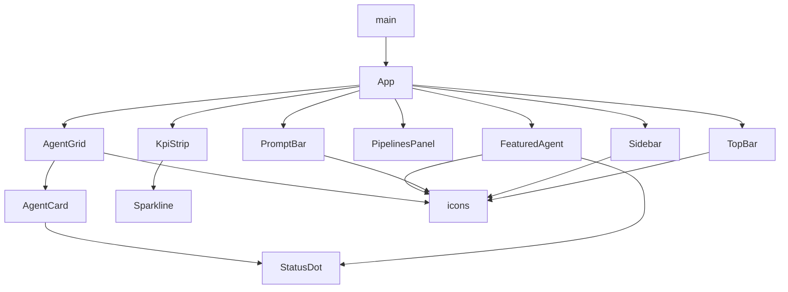

**Section root:** `src`

> React + Vite single-page application. Renders the Agent Console dashboard.

<!-- fill:overview:summary -->
<FILL: 3-5 sentences on what this subsystem owns, the runtime boundaries, and the data it produces or consumes. Reference the diagrams below by name.>
<!-- /fill:overview:summary -->

## Top-level structure

| Folder | Purpose |
| --- | --- |
| [`components/`](./frontend/components/overview/) | <FILL: one line on what lives in components/ and when to add a file here.> |
| [`data/`](./frontend/data/overview/) | <FILL: one line on what lives in data/ and when to add a file here.> |
| [`lib/`](./frontend/lib/overview/) | <FILL: one line on what lives in lib/ and when to add a file here.> |
| [`test/`](./frontend/test/overview/) | <FILL: one line on what lives in test/ and when to add a file here.> |

### Files at the root of this section

| File | Hint |
| --- | --- |
| [`App.tsx`](./app) | <FILL: one-line purpose for App.tsx> |
| [`main.tsx`](./main) | <FILL: one-line purpose for main.tsx> |

## Architecture

### Module dependency graph

### React component tree

## Key flows

<!-- fill:overview:flows -->
<FILL: 2-3 short flow descriptions — the most important runtime sequences in this subsystem. Reference symbols by their documented file (use relative links).>
<!-- /fill:overview:flows -->

## When to add code here

<!-- fill:overview:when-to-add -->
<FILL: practical guidance for someone deciding whether a new module belongs in this subsystem or somewhere else.>
<!-- /fill:overview:when-to-add -->
