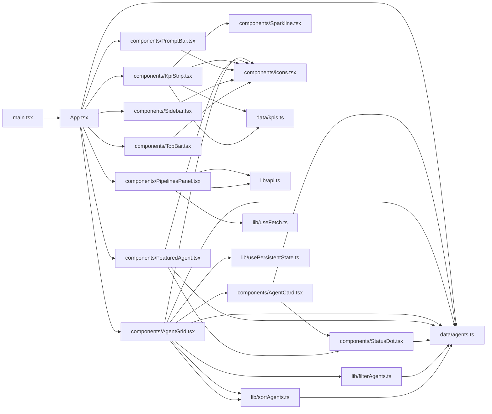
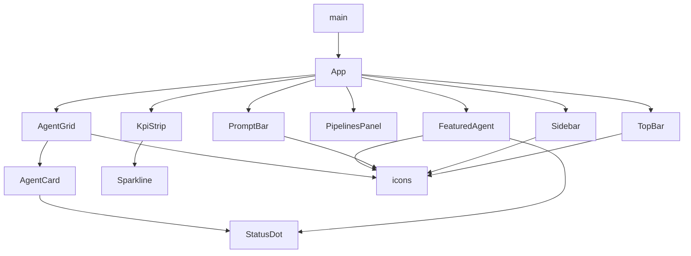

**Section root:** `src`

> React + Vite single-page application. Renders the Agent Console dashboard.

<!-- fill:overview:summary -->
The `src/` tree is the entire Snabbit Agent Console UI — a React + Vite single-page app that runs in the browser. It owns nothing on the server: it reads the static agent catalogue and KPI seed from `data/`, fetches live CI/CD data from the Express API at `/api/pipelines` through `lib/api.ts`, and renders the dashboard via the components in `components/`. The **Module dependency graph** below shows how `App.tsx` composes those components, and the **React component tree** shows the runtime parent/child structure starting from `main.tsx`.
<!-- /fill:overview:summary -->

## Top-level structure

| Folder | Purpose |
| --- | --- |
| [`components/`](./frontend/components/overview/) | All React components — sidebar, top bar, KPI strip, featured agent card, agent grid, pipelines panel, prompt bar, the inline icon set, and the small leaf components they share. |
| [`data/`](./frontend/data/overview/) | Static seed data shipped with the bundle — the agent catalogue (`agents.ts`) and the KPI list (`kpis.ts`) — along with their TypeScript types. |
| [`lib/`](./frontend/lib/overview/) | Pure helpers and shared React hooks — the typed API client, `useFetch`/`usePersistentState`, and the `filterAgents`/`sortAgents` pure functions that back the agent grid. |
| [`test/`](./frontend/test/overview/) | Vitest setup file — wires `@testing-library/jest-dom` matchers in for every test in `src/`. |

### Files at the root of this section

| File | Hint |
| --- | --- |
| [`App.tsx`](./app) | Root component — splits `AGENTS` into the featured agent and the rest, then lays out `Sidebar`, `TopBar`, `KpiStrip`, `FeaturedAgent`, `PipelinesPanel`, `AgentGrid`, and `PromptBar`. |
| [`main.tsx`](./main) | Vite entrypoint — imports `index.css`, creates the React root on `#root`, and renders `<App />` inside `StrictMode`. |

## Architecture

### Module dependency graph

### React component tree

## Key flows

<!-- fill:overview:flows -->
- **Initial render.** [`main.tsx`](./main) mounts [`App`](./app) under `StrictMode`. `App` derives `featured` and `rest` from [`AGENTS`](./frontend/data/agents/) and renders the chrome (`Sidebar`, `TopBar`, `PromptBar`) plus the dashboard sections ([`KpiStrip`](./frontend/components/kpistrip/), [`FeaturedAgent`](./frontend/components/featuredagent/), [`PipelinesPanel`](./frontend/components/pipelinespanel/), [`AgentGrid`](./frontend/components/agentgrid/)).
- **Pipelines fetch.** [`PipelinesPanel`](./frontend/components/pipelinespanel/) calls [`useFetch`](./frontend/lib/usefetch/) with [`fetchPipelines`](./frontend/lib/api/) on mount; the hook owns the `AbortController` lifecycle and exposes `loading`/`error`/`data`/`reload`. The Refresh button bumps the hook's nonce to re-run the fetch.
- **Agent filtering and sort.** [`AgentGrid`](./frontend/components/agentgrid/) reads category and sort from [`usePersistentState`](./frontend/lib/usepersistentstate/) (`localStorage`), keeps `query` and `selectedId` in component state, and recomputes the visible list with [`filterAgents`](./frontend/lib/filteragents/) and [`sortAgents`](./frontend/lib/sortagents/) inside a `useMemo`.
<!-- /fill:overview:flows -->

## When to add code here

<!-- fill:overview:when-to-add -->
Add code here if it is part of the browser UI. New JSX-rendering components go under `components/`; pure functions or React hooks that two or more components want to share belong in `lib/`; new static seed data or its accompanying types go in `data/`. Anything that needs a database, an Anthropic API key, or a Node `process.env` lookup belongs in `server/` (Express API) or `chat-worker/` (Cloudflare Worker), not here.
<!-- /fill:overview:when-to-add -->
