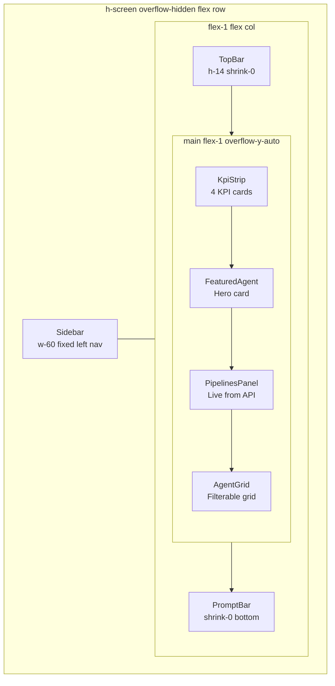

The frontend is a single-page dashboard built with **Vite + React 19 +
TypeScript + Tailwind CSS v4**. It lives at the repository root.

## Entry points

### `index.html`

The HTML shell. Sets `class="dark"` and `color-scheme: dark`, embeds an inline
pink SVG favicon, and loads the Geist / Geist Mono web fonts from Google Fonts
with `preconnect` hints. Mounts the app into `#root`.

### `src/main.tsx`

Creates the React root and renders `<App />` inside `<StrictMode>`:

```tsx
createRoot(document.getElementById('root')!).render(
  <StrictMode>
    <App />
  </StrictMode>,
)
```

`StrictMode` enables double-invocation of effects in development to surface
side-effect issues. The non-null assertion on `getElementById('root')` is safe
because `index.html` always provides the element.

### `src/App.tsx`

The root component. Splits `AGENTS` into the featured agent and the remainder,
then composes the dashboard layout:

```tsx
export default function App() {
  const featured = AGENTS.find((a) => a.id === FEATURED_AGENT_ID) ?? AGENTS[0]
  const rest = AGENTS.filter((a) => a.id !== featured.id)

  return (
    <div className="flex h-screen overflow-hidden">
      <Sidebar />
      <div className="flex min-w-0 flex-1 flex-col">
        <TopBar />
        <main className="flex-1 overflow-y-auto">
          <div className="mx-auto flex max-w-6xl flex-col gap-5 px-5 py-5">
            <KpiStrip />
            <FeaturedAgent agent={featured} />
            <PipelinesPanel />
            <AgentGrid agents={rest} />
          </div>
        </main>
        <PromptBar />
      </div>
    </div>
  )
}
```

A 60rem (`max-w-6xl`) centered content column with 20px (`px-5 py-5`) padding
and 20px (`gap-5`) between panels.

## Layout diagram



## Source structure

| Path | Contents |
|------|---------|
| `src/App.tsx` | Root component, dashboard layout |
| `src/main.tsx` | React root creation |
| `src/index.css` | Tailwind import + design tokens |
| `src/components/` | UI components (presentational) |
| `src/lib/` | API client, hooks, pure logic |
| `src/data/` | Static seed data and domain types |
| `src/test/` | Vitest setup (`setup.ts`) |

## Data flow summary

| Panel | Data source | Backend call? |
|-------|------------|---------------|
| KpiStrip | `src/data/kpis.ts` | No |
| FeaturedAgent | `src/data/agents.ts` | No |
| PipelinesPanel | `GET /api/pipelines` via `useFetch` | **Yes** |
| AgentGrid | `src/data/agents.ts` | No |

## Build tooling

`vite.config.ts` configures Vite for both development and testing:

```ts
export default defineConfig({
  plugins: [react(), tailwindcss()],
  test: {
    environment: 'jsdom',
    globals: true,
    setupFiles: './src/test/setup.ts',
    css: true,
  },
})
```

`@tailwindcss/vite` integrates Tailwind v4's CSS engine directly into Vite,
eliminating a separate PostCSS step. `environment: 'jsdom'` gives tests a
browser-like DOM; `css: true` enables CSS class resolution in tests.

## Per-file reference

### Entry points

- [App.tsx](/sdlc-sample-worflow/frontend/app/) — root component and dashboard layout
- [main.tsx](/sdlc-sample-worflow/frontend/main/) — React root creation and mount
- [vite.config.ts](/sdlc-sample-worflow/frontend/vite-config/) — build and test configuration
- [test/setup.ts](/sdlc-sample-worflow/frontend/test-setup/) — jest-dom matchers and localStorage isolation

### Components (`src/components/`)

- [AgentCard](/sdlc-sample-worflow/frontend/components/agentcard/) — individual agent tile
- [AgentGrid](/sdlc-sample-worflow/frontend/components/agentgrid/) — filterable, sortable catalogue
- [FeaturedAgent](/sdlc-sample-worflow/frontend/components/featuredagent/) — hero card
- [KpiStrip](/sdlc-sample-worflow/frontend/components/kpistrip/) — metric cards
- [PipelinesPanel](/sdlc-sample-worflow/frontend/components/pipelinespanel/) — live CI/CD panel
- [PromptBar](/sdlc-sample-worflow/frontend/components/promptbar/) — bottom prompt input
- [Sidebar](/sdlc-sample-worflow/frontend/components/sidebar/) — left navigation
- [Sparkline](/sdlc-sample-worflow/frontend/components/sparkline/) — trend line SVG
- [StatusDot](/sdlc-sample-worflow/frontend/components/statusdot/) — colored status indicator
- [TopBar](/sdlc-sample-worflow/frontend/components/topbar/) — header bar
- [icons](/sdlc-sample-worflow/frontend/components/icons/) — inline SVG icon set

### Library (`src/lib/`)

- [api.ts](/sdlc-sample-worflow/frontend/lib/api/) — typed HTTP client
- [filterAgents](/sdlc-sample-worflow/frontend/lib/filteragents/) — category + query filter
- [sortAgents](/sdlc-sample-worflow/frontend/lib/sortagents/) — four sort strategies
- [useFetch](/sdlc-sample-worflow/frontend/lib/usefetch/) — data-fetching hook
- [usePersistentState](/sdlc-sample-worflow/frontend/lib/usepersistentstate/) — localStorage-backed state

### Data (`src/data/`)

- [agents.ts](/sdlc-sample-worflow/frontend/data/agents/) — 12-agent catalogue + types
- [kpis.ts](/sdlc-sample-worflow/frontend/data/kpis/) — 4-KPI catalogue + types
