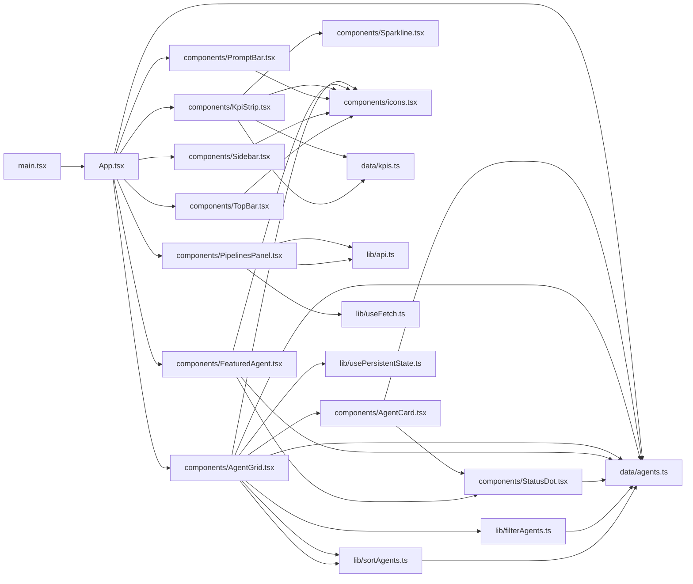
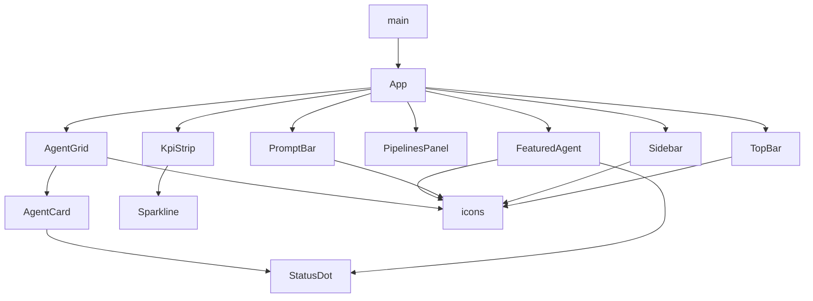

**Section root:** `src`

> React + Vite single-page application. Renders the Agent Console dashboard.

<!-- fill:overview:summary -->
The frontend is a React + Vite single-page application that renders the Agent Console dashboard. `main.tsx` mounts the root `App`, which composes the layout — `Sidebar`, `TopBar`, `KpiStrip`, `FeaturedAgent`, `PipelinesPanel`, `AgentGrid`, and `PromptBar`. Most of its content is driven by static seed data in `data/` (`AGENTS` and `KPIS`), so the only live runtime boundary is `PipelinesPanel`, which fetches CI pipeline data from the backend through `lib/api.ts` and `useFetch`. The Module dependency graph below shows how these files import one another, and the React component tree shows the parent-to-child render hierarchy.
<!-- /fill:overview:summary -->

## Top-level structure

| Folder | Purpose |
| --- | --- |
| [`components/`](./frontend/components/overview/) | React presentational components (cards, panels, the grid, icons); add a file here for any new piece of rendered UI. |
| [`data/`](./frontend/data/overview/) | Static seed datasets and their types (`AGENTS`, `KPIS`); add a file here for new presentational data, not logic. |
| [`lib/`](./frontend/lib/overview/) | Framework-agnostic helpers and hooks (`filterAgents`, `sortAgents`, `useFetch`, `usePersistentState`, `api`); add reusable non-UI logic here. |
| [`test/`](./frontend/test/overview/) | Shared Vitest bootstrapping (`setup.ts`); add a file here only for cross-cutting test setup, not individual specs. |

### Files at the root of this section

| File | Hint |
| --- | --- |
| [`App.tsx`](./app) | Root component that derives the featured agent from `AGENTS` and composes the dashboard layout. |
| [`main.tsx`](./main) | Vite entry point: creates the React root and renders `App` inside `StrictMode`. |

## Architecture

### Module dependency graph

### React component tree

## Key flows

<!-- fill:overview:flows -->
- **Boot:** [`main.tsx`](./main) creates the React root and renders [`App`](./app) in `StrictMode`; `App` looks up `FEATURED_AGENT_ID` in [`AGENTS`](./data/agents) and renders the rest into [`AgentGrid`](./components/agentgrid).
- **Agent browsing:** [`AgentGrid`](./components/agentgrid) keeps the active category and sort in [`usePersistentState`](./lib/usepersistentstate), then runs [`filterAgents`](./lib/filteragents) and [`sortAgents`](./lib/sortagents) before rendering an [`AgentCard`](./components/agentcard) per result.
- **Live pipelines:** [`PipelinesPanel`](./components/pipelinespanel) calls [`useFetch`](./lib/usefetch) against [`api.ts`](./lib/api) to load CI pipeline status from the backend — the only network dependency in the frontend.
<!-- /fill:overview:flows -->

## When to add code here

<!-- fill:overview:when-to-add -->
Add code here when it concerns what the user sees or interacts with in the browser. Rendered UI goes in `components/`, reusable non-UI logic and hooks go in `lib/`, and presentational seed data with its types goes in `data/`. If the change is about server-side request handling, persistence, or background processing, it belongs in the backend or chat-worker subsystems instead — the frontend should only reach the server through `lib/api.ts`.
<!-- /fill:overview:when-to-add -->
