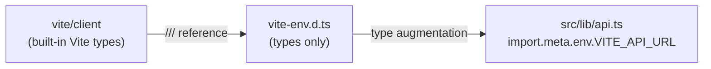

**File:** `src/vite-env.d.ts`

Augments the global `ImportMeta` interface so TypeScript knows about the Vite
client types and the one custom environment variable exposed to the frontend.

## Full source

```ts
/// <reference types="vite/client" />

interface ImportMetaEnv {
  /** Base URL of the Snabbit API. Defaults to http://localhost:3001. */
  readonly VITE_API_URL?: string
}

interface ImportMeta {
  readonly env: ImportMetaEnv
}
```

## Triple-slash directive

```ts
/// <reference types="vite/client" />
```

Pulls in Vite's built-in type declarations (`vite/client`). Those declarations
add `ImportMetaEnv` with all the built-in Vite variables (`MODE`, `BASE_URL`,
`PROD`, `DEV`, etc.) and type `import.meta.hot`. The two interface declarations
below then **merge** into the types Vite already declared.

## `ImportMetaEnv`

```ts
interface ImportMetaEnv {
  readonly VITE_API_URL?: string
}
```

Adds the one project-specific variable to `ImportMetaEnv`. Because TypeScript
interfaces merge by declaration, this extends Vite's built-in `ImportMetaEnv`
rather than replacing it.

| Variable | Type | Purpose |
|----------|------|---------|
| `VITE_API_URL` | `string?` | Base URL for the backend REST API. Optional — defaults to `'http://localhost:3001'` in `src/lib/api.ts` when absent at build time. |

`readonly` prevents accidental mutation; Vite replaces all `import.meta.env.*`
references with literals at build time, so they are never truly mutable at
runtime anyway.

## `ImportMeta`

```ts
interface ImportMeta {
  readonly env: ImportMetaEnv
}
```

Narrows `import.meta.env` to the custom `ImportMetaEnv` type so TypeScript
resolves `import.meta.env.VITE_API_URL` to `string | undefined` rather than
the unsafe `any`.

## How `VITE_API_URL` is consumed

`src/lib/api.ts` reads the variable at module scope:

```ts
const API_URL = import.meta.env.VITE_API_URL ?? 'http://localhost:3001'
```

Vite replaces `import.meta.env.VITE_API_URL` with the literal value at build
time, or with `undefined` if the variable is not set. The nullish coalescing
fallback `?? 'http://localhost:3001'` applies when the variable is absent.

To override in development, set `VITE_API_URL` in a `.env.local` file at the
repository root:

```
VITE_API_URL=http://my-server:3001
```

Only variables prefixed `VITE_` are exposed to the client bundle; the prefix
is a Vite security convention that prevents accidental exposure of server-only
secrets.

## Module graph



## Used by

- `src/lib/api.ts` — the only file that reads `import.meta.env.VITE_API_URL`.
- Implicitly, any future code that references `import.meta.env.*` will have the
  full merged type available.
