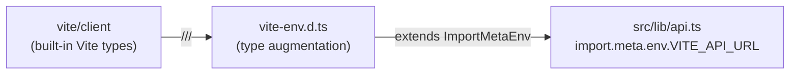

**File:** `src/vite-env.d.ts`

Augments the global `ImportMeta` interface so TypeScript understands Vite's built-in environment types and the one project-specific environment variable exposed to the frontend bundle.

## Full source

```ts
/// <reference types="vite/client" />

interface ImportMetaEnv {
  readonly VITE_API_URL?: string
}

interface ImportMeta {
  readonly env: ImportMetaEnv
}
```

## The `/// <reference types="vite/client" />` directive

```ts
/// <reference types="vite/client" />
```

This triple-slash directive pulls in Vite's built-in type declarations from the `vite/client` package. Those declarations provide:

- A base `ImportMetaEnv` interface with the built-in Vite variables: `MODE`, `BASE_URL`, `PROD`, `DEV`, `SSR`.
- Types for `import.meta.hot` (the HMR API).
- Types for `import.meta.glob` (Vite's glob imports).
- Asset module declarations (e.g. importing `.png`, `.svg`, `.json` files).

The two interface declarations below this directive use TypeScript **declaration merging** — they extend the types that `vite/client` already declared rather than replacing them.

## `ImportMetaEnv` interface

```ts
interface ImportMetaEnv {
  readonly VITE_API_URL?: string
}
```

Adds the one project-specific environment variable to `ImportMetaEnv`. Because both this declaration and the one from `vite/client` are global interfaces with the same name, TypeScript merges them: the resulting `ImportMetaEnv` has all of Vite's built-in fields plus `VITE_API_URL`.

| Variable | Type | Default | Purpose |
|---|---|---|---|
| `VITE_API_URL` | `string \| undefined` | `http://localhost:3001` (applied in `api.ts`) | Base URL for the Snabbit backend REST API. Set via `.env.local` to override for a specific environment. |

`readonly` prevents accidental mutation in application code. At build time, Vite replaces all `import.meta.env.*` references with their literal values (or `undefined`), so they are never truly mutable at runtime.

The field is `optional` (`?`) because it may not be set — the consuming code in `api.ts` provides a fallback with the nullish coalescing operator:

```ts
const API_URL = import.meta.env.VITE_API_URL ?? 'http://localhost:3001'
```

## `ImportMeta` interface

```ts
interface ImportMeta {
  readonly env: ImportMetaEnv
}
```

Narrows the type of `import.meta.env` from the default `any` (in environments without `vite/client`) to the fully-typed `ImportMetaEnv`. This makes every access of `import.meta.env.VITE_API_URL` type-safe: TypeScript knows the type is `string | undefined`, not `any`, and will warn if you try to call string methods on it without a null check.

## How `VITE_API_URL` is consumed

`src/lib/api.ts` reads the variable at module scope, before any function is called:

```ts
const API_URL = import.meta.env.VITE_API_URL ?? 'http://localhost:3001'
```

**At build time:** Vite replaces `import.meta.env.VITE_API_URL` with the literal string value if the variable is set, or with `undefined` if it is not. The `?? 'http://localhost:3001'` fallback collapses the undefined case to the local dev default.

**At development time:** Vite reads variables from `.env`, `.env.local`, `.env.development`, etc. in order of precedence. Variables without the `VITE_` prefix are never exposed to the browser bundle — this is a Vite security convention that prevents accidentally leaking backend secrets.

### Overriding for different environments

```bash
# .env.local (git-ignored)
VITE_API_URL=http://my-staging-server:3001
```

```bash
# .env.production
VITE_API_URL=https://api.snabbit.example.com
```

## Module graph



## Files that use `import.meta.env`

| File | Variable accessed |
|---|---|
| `src/lib/api.ts` | `VITE_API_URL` |

All other files that access `import.meta.env` use Vite's built-in variables (`MODE`, `PROD`, `DEV`) which are typed by `vite/client` and do not require additions to this file.
