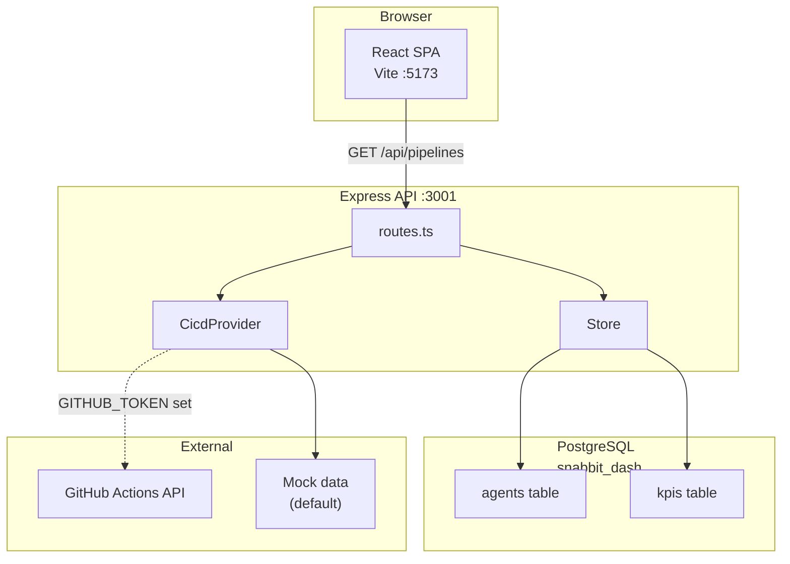

The Snabbit Agent Console is an internal AI workflow console for Snabbit's ops
team — a dense, dark, "Linear-grade" dashboard for running SDLC agents (PR
review, deploys, RCAs, alert triage), backed by a REST API and a live CI/CD
integration.

:::note
This documentation is maintained automatically. On a schedule, a documentation
agent reviews the codebase and updates these pages.
:::

## What's in the box

The project is a single repository with two packages:

- **Frontend** (repository root) — a Vite + React 19 + TypeScript + Tailwind
  CSS v4 single-page dashboard.
- **Backend** (`server/`) — an Express 5 + TypeScript REST API backed by
  PostgreSQL, with a pluggable CI/CD integration (GitHub Actions / Jenkins,
  mock by default).

## System overview

## The dashboard at a glance

The console (`src/App.tsx`) is a fixed-width sidebar next to a flex column
containing a top bar, a scrollable main region, and a pinned prompt bar. The
main region stacks four panels:

| Panel | Source | Wired to backend? |
|-------|--------|-------------------|
| KPI strip | Local seed data | No |
| Featured agent | Local seed data | No |
| CI/CD pipelines | `GET /api/pipelines` | **Yes** |
| Agent grid | Local seed data | No |

## Where to start

- [Getting started](/sdlc-sample-worflow/getting-started/) — run the frontend
  and backend locally.
- [Architecture](/sdlc-sample-worflow/architecture/) — how the pieces fit
  together, with diagrams.

### Frontend

- [Overview](/sdlc-sample-worflow/frontend/overview/) — layout, entry points, build tooling
- [App.tsx](/sdlc-sample-worflow/frontend/app/) — root component and dashboard assembly
- [Components](/sdlc-sample-worflow/frontend/components/) — all UI components
- [Library](/sdlc-sample-worflow/frontend/lib/) — hooks and pure functions
- [Data & types](/sdlc-sample-worflow/frontend/data/) — agent and KPI seed data
- [Styling](/sdlc-sample-worflow/frontend/styling/) — Tailwind tokens

### Backend

- [Overview](/sdlc-sample-worflow/backend/overview/) — architecture, DI pattern
- [REST API](/sdlc-sample-worflow/backend/api/) — all endpoints
- [Data model](/sdlc-sample-worflow/backend/data-model/) — types + schema
- [Stores](/sdlc-sample-worflow/backend/stores/) — memory + Postgres implementations
- [CI/CD integration](/sdlc-sample-worflow/backend/cicd-integration/) — mock + GitHub

### Testing

- [Testing](/sdlc-sample-worflow/testing/) — 49 tests across both packages, with full per-suite breakdowns
