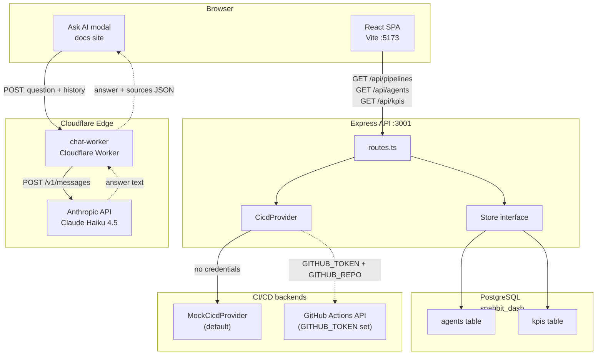

import { Card, CardGrid, LinkCard } from '@astrojs/starlight/components';

The **Snabbit Agent Console** is an internal AI workflow console for Snabbit's ops team. It is a dense, dark, Linear-grade dashboard for running SDLC agents — PR review, deploys, RCAs, alert triage — backed by a REST API and a live CI/CD integration.

The UI is purpose-built for power users who need high information density, keyboard-first navigation, and instant feedback.

:::note
This documentation is maintained automatically. On a schedule, a documentation agent reviews the codebase and updates these pages.
:::

## Start here

<CardGrid>
  <LinkCard title="Getting started" description="Run the frontend, backend, and chat worker locally in under five minutes." href="/sdlc-sample-worflow/getting-started/" />
  <LinkCard title="Architecture" description="How the React SPA, Express API, Postgres, CI/CD adapter, and chat worker fit together." href="/sdlc-sample-worflow/architecture/" />
  <LinkCard title="Testing" description="49 tests across both packages — Vitest + React Testing Library on the frontend, Vitest + supertest on the backend." href="/sdlc-sample-worflow/testing/" />
</CardGrid>

## What's in the box

Three packages in one repository — they build, test, and run independently.

<CardGrid>
  <Card title="Frontend" icon="laptop">
    Vite 8 + React 19 + TypeScript 6 + Tailwind CSS v4 single-page dashboard. Most panels render from static seed data; only the CI/CD pipelines panel makes a live network call.
  </Card>
  <Card title="Backend" icon="seti:db">
    Express 5 + TypeScript REST API backed by PostgreSQL. Pluggable CI/CD provider (mock by default, GitHub Actions when credentials are set). Dependencies injected, so tests need no database and no network.
  </Card>
  <Card title="Chat worker" icon="rocket">
    Stateless Cloudflare Worker that keyword-searches a bundled <code>docs-index.json</code>, then calls the Anthropic API (Claude Haiku 4.5) to answer questions using only the retrieved excerpts.
  </Card>
</CardGrid>

## System overview

## Frontend

<CardGrid>
  <LinkCard title="Overview" description="Layout, entry points, build tooling." href="/sdlc-sample-worflow/frontend/overview/" />
  <LinkCard title="App.tsx" description="Root component and dashboard assembly." href="/sdlc-sample-worflow/frontend/app/" />
  <LinkCard title="Components" description="Every UI component, with props and tests." href="/sdlc-sample-worflow/frontend/components/overview/" />
  <LinkCard title="Library" description="Hooks (useFetch, usePersistentState) and pure functions (filterAgents, sortAgents)." href="/sdlc-sample-worflow/frontend/lib/overview/" />
  <LinkCard title="Data & types" description="Agent and KPI seed data, shared between frontend and backend." href="/sdlc-sample-worflow/frontend/data/overview/" />
</CardGrid>

## Backend

<CardGrid>
  <LinkCard title="Overview" description="Architecture and dependency-injection pattern." href="/sdlc-sample-worflow/backend/overview/" />
  <LinkCard title="Routes" description="Every REST endpoint registered on the Express app." href="/sdlc-sample-worflow/backend/routes/" />
  <LinkCard title="Domain model" description="The Agent, Kpi, and Pipeline types." href="/sdlc-sample-worflow/backend/domain/" />
  <LinkCard title="Stores" description="In-memory and PostgreSQL implementations." href="/sdlc-sample-worflow/backend/store/" />
  <LinkCard title="CI/CD integration" description="Mock and GitHub Actions providers." href="/sdlc-sample-worflow/backend/integrations/cicd/" />
  <LinkCard title="Database" description="Schema, setup, and seed data." href="/sdlc-sample-worflow/backend/db/overview/" />
</CardGrid>

## Chat worker

<CardGrid>
  <LinkCard title="Overview" description='"Ask the docs" chatbot architecture — Cloudflare Worker + Claude Haiku 4.5.' href="/sdlc-sample-worflow/chat-worker/overview/" />
  <LinkCard title="Worker (src/index.js)" description="Request handler, keyword search, Anthropic API call." href="/sdlc-sample-worflow/chat-worker/index/" />
</CardGrid>

## For AI agents

If you're a coding agent indexing this site:

- **Discovery index** — [`/llms.txt`](/sdlc-sample-worflow/llms.txt) lists every page with title and description.
- **Full corpus** — [`/llms-full.txt`](/sdlc-sample-worflow/llms-full.txt) is the entire documentation concatenated as plain text.
- **Per-page markdown** — append `.md` to any page URL to get the raw Markdown source.
- **Ask AI** — there's an "Ask AI" button in the site header (⌘+I) that opens a chatbot grounded in this documentation.
