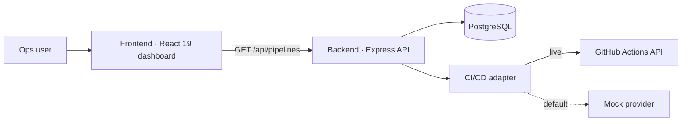
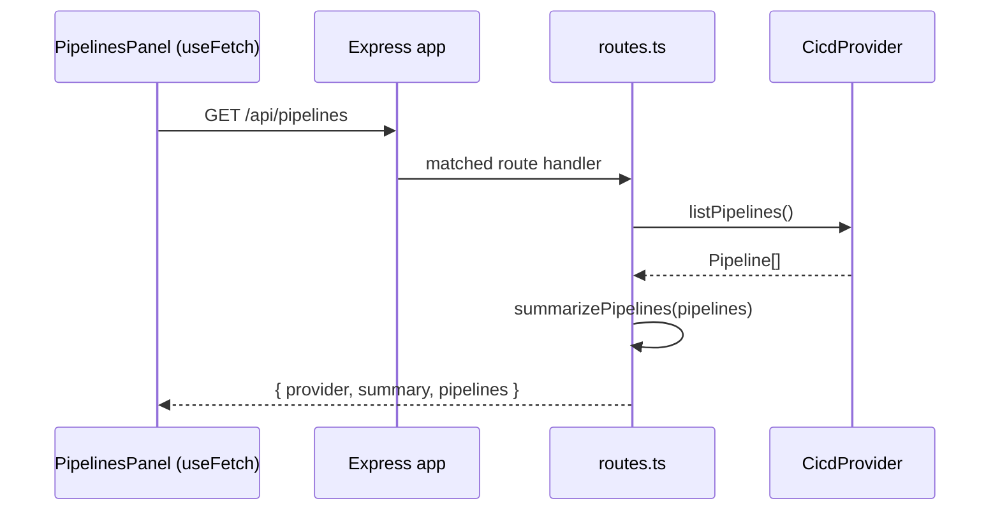

# Architecture

The console is split into a **frontend** (a React single-page app at the repo
root) and a **backend** (an Express REST API under `server/`). They communicate
over HTTP and JSON.



## Frontend

The frontend lives at the repository root: **Vite + React 19 + TypeScript +
Tailwind CSS v4**. It is a static client — no router and no global state library.
The root [`App`](frontend/index.md) composes a fixed shell (Sidebar, TopBar,
PromptBar) around a scrolling main column (KPI strip, featured agent, pipelines
panel, agent grid). See [Frontend overview](frontend/index.md).

## Backend

The backend lives in `server/`: **Express 5 + TypeScript**, a **PostgreSQL**
database accessed through the `pg` `Pool`, and a pluggable **CI/CD integration
adapter**. The app is assembled from injected dependencies (a `Store` and a
`CicdProvider`), which is what lets the test suite swap in an in-memory store and
a mock provider. See [Backend overview](backend/index.md).

## How they connect

| Console section          | Data source today                              |
| ------------------------ | ---------------------------------------------- |
| CI/CD pipelines panel    | **Live** — `GET /api/pipelines` on the backend |
| Agent grid               | Local seed data in `src/data/agents.ts`        |
| KPI strip                | Local seed data in `src/data/kpis.ts`          |
| Featured agent           | Local seed data (the `pr-reviewer` entry)      |

The dashboard's CI/CD pipelines panel reads live from the backend. The agent grid
and KPIs still use bundled seed data; the backend already exposes the same data
at `GET /api/agents` and `GET /api/kpis`, and finishing that migration is the top
item in `BACKLOG.md`.

!!! note "Two copies of the seed data"
    The same catalogue exists twice today: `src/data/agents.ts` /
    `src/data/kpis.ts` on the frontend, and `server/src/seed.ts` on the backend.
    The domain types are mirrored too (`src/data/agents.ts` vs.
    `server/src/domain.ts`). They are kept in sync by hand until the frontend
    migration lands.

## Request flow (pipelines panel)



## Project layout

```text
.                    Frontend (Vite + React)
  index.html          HTML entry; loads /src/main.tsx
  src/
    main.tsx          React root + StrictMode
    App.tsx           Top-level composition
    components/       UI components + their tests
    lib/              Pure logic, API client, hooks
    data/             Local seed data + types
    index.css         Tailwind import + design tokens
    test/setup.ts     Vitest setup (jest-dom, localStorage reset)
  vite.config.ts      Vite + Vitest config
server/              Backend (Express + Postgres)
  src/
    index.ts          Composition root (Pool, store, provider, listen)
    app.ts            createApp(deps) — Express wiring
    routes.ts         REST route registration
    config.ts         Env-driven runtime config
    domain.ts         Agent / Kpi domain types
    store.ts          Store interface + in-memory store
    postgresStore.ts  Postgres-backed store
    seed.ts           Seed agents + KPIs
    integrations/
      cicd.ts         CI/CD adapter (mock + GitHub Actions)
    db/
      schema.ts       SQL DDL (idempotent)
      setup.ts        One-shot create-tables + upsert-seed script
    __tests__/        api.test.ts, cicd.test.ts
```

## Design principles in the code

- **Dependency injection over globals.** `createApp({ store, cicd })` takes its
  collaborators as arguments so behaviour can be swapped in tests.
- **Pure functions for logic.** `filterAgents`, `sortAgents` (frontend) and
  `summarizePipelines` (backend) are side-effect free and unit-tested directly.
- **Adapter pattern for integrations.** `CicdProvider` is an interface with a
  mock and a live implementation, chosen at startup by `getCicdProvider`.
