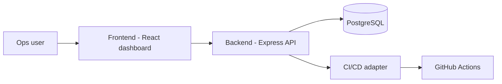

# Architecture

The console is split into a frontend and a backend.



## Frontend

The frontend lives at the repository root: Vite, React 19, TypeScript, and
Tailwind CSS v4. See [Frontend](frontend.md).

## Backend

The backend lives in `server/`: Express and TypeScript, a PostgreSQL database,
and a CI/CD integration adapter. See [Backend](backend.md).

## How they connect

The dashboard's CI/CD pipelines panel reads live from the backend. The agent
grid and KPIs still use local seed data — completing that migration is the top
item in `BACKLOG.md`.

## Project layout

```text
.                  Frontend (Vite + React)
  src/components/   UI components + tests
  src/lib/          Pure logic, API client, hooks
  src/data/         Local seed data + types
server/            Backend (Express + Postgres)
  src/              app, routes, stores, integrations
  src/db/           schema + seed script
```
