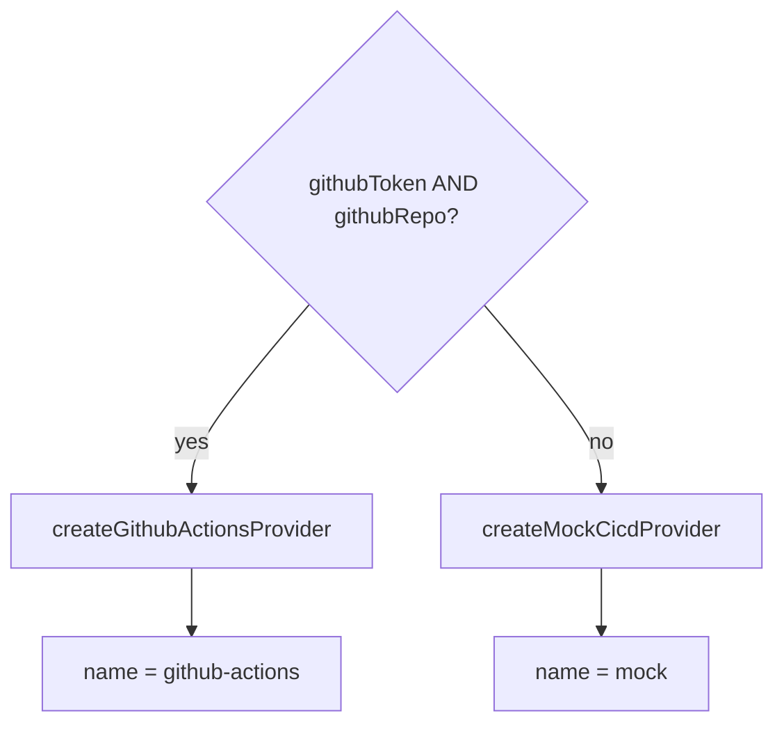

# CI/CD integration

The CI/CD adapter lives in `server/src/integrations/cicd.ts`. It powers
`GET /api/pipelines` and the dashboard's [pipelines panel](../frontend/components.md#pipelinespanel).
It follows an **adapter pattern**: a `CicdProvider` interface with a deterministic
mock implementation (the default) and a live GitHub Actions implementation,
chosen at startup.

## Types

```ts
type PipelineStatus = 'passing' | 'failing' | 'running'

interface Pipeline {
  id: string
  name: string
  provider: 'github-actions' | 'jenkins'
  branch: string
  status: PipelineStatus
  durationSeconds: number
  triggeredBy: string
  updatedAt: string            // ISO 8601
}

interface PipelineSummary {
  total: number
  passing: number
  failing: number
  running: number
  passRate: number             // 0–100, over finished (passing+failing) pipelines
}

interface CicdProvider {
  readonly name: string
  listPipelines(): Promise<Pipeline[]>
}
```

These mirror the frontend client types in [`src/lib/api.ts`](../frontend/lib.md#pipeline-types).

## `summarizePipelines(pipelines)`

A pure aggregation used by the `/api/pipelines` route:

```ts
function summarizePipelines(pipelines: Pipeline[]): PipelineSummary
```

- Counts `passing`, `failing`, and `running`.
- `total` is the array length.
- **`passRate` is computed over finished pipelines only** —
  `finished = passing + failing`, then `Math.round((passing / finished) * 100)`.
  Running pipelines are excluded from the denominator.
- Returns all-zero (including `passRate: 0`) for an empty list, guarding the
  divide-by-zero (`finished === 0 ? 0 : …`).

!!! example "Pass-rate maths"
    2 passing, 1 failing, 1 running → finished = 3 → `round(2/3 × 100)` = **67%**.

## Provider selection — `getCicdProvider(env)`

```ts
function getCicdProvider(env: { githubToken: string; githubRepo?: string }): CicdProvider
```

Returns the **live GitHub Actions provider when both `githubToken` and
`githubRepo` are set**, otherwise the **mock** provider. The running server calls
this from `index.ts` with values from [config](configuration.md); the chosen
provider's `name` is logged on startup and echoed in the API response.



## Mock provider — `createMockCicdProvider()`

`name: 'mock'`. `listPipelines()` returns 8 deterministic pipelines built by
`buildMockPipelines()`. Their `updatedAt` timestamps are computed relative to
"now" via the `minutesAgo(minutes)` helper, so they always look recent. The set
mixes `github-actions` and `jenkins` providers, several branches
(`main`, `release/4.19`, `feat/agent-drawer`, `feat/pg-store`), and all three
statuses — which gives the panel a realistic summary with no credentials.

## Live provider — `createGithubActionsProvider(token, repo)`

`name: 'github-actions'`. `listPipelines()` calls the GitHub REST API:

```
GET https://api.github.com/repos/{repo}/actions/runs?per_page=20
Authorization: Bearer {token}
Accept: application/vnd.github+json
X-GitHub-Api-Version: 2022-11-28
```

A non-OK response throws `Error("GitHub Actions API responded {status}")` (caught
by the app's error handler → `500 JSON`). Otherwise each `workflow_run` is mapped
to a `Pipeline` by `githubRunToPipeline`:

| `Pipeline` field  | Derived from                                                       |
| ----------------- | ------------------------------------------------------------------ |
| `id`              | `String(run.id)`                                                   |
| `name`            | `run.name ?? run.display_title`                                    |
| `provider`        | always `'github-actions'`                                          |
| `branch`          | `run.head_branch ?? 'unknown'`                                     |
| `status`          | `running` if `run.status !== 'completed'`; else `passing` when `conclusion === 'success'`, otherwise `failing` |
| `durationSeconds` | `max(0, round((updated_at − (run_started_at ?? updated_at)) / 1000))` |
| `triggeredBy`     | `run.actor?.login ?? 'unknown'`                                    |
| `updatedAt`       | `run.updated_at`                                                   |

!!! note "Token scope"
    The token needs `repo` + `actions:read`. Set `GITHUB_TOKEN` and
    `GITHUB_REPO` (`owner/repo`) to activate the live provider — see
    [Configuration](configuration.md).
