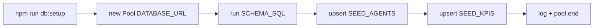

# Database

The running server stores the agent catalogue and KPIs in **PostgreSQL**. The
schema and a one-shot setup/seed script live under `server/src/db/`.

## Schema (`db/schema.ts`)

`SCHEMA_SQL` is an idempotent DDL string (`CREATE TABLE IF NOT EXISTS`) with two
tables.

### `agents`

| Column             | Type      | Notes        |
| ------------------ | --------- | ------------ |
| `id`               | `TEXT`    | Primary key  |
| `name`             | `TEXT`    | Not null     |
| `category`         | `TEXT`    | Not null     |
| `description`      | `TEXT`    | Not null     |
| `status`           | `TEXT`    | Not null     |
| `runs_per_week`    | `INTEGER` | Not null     |
| `success_rate`     | `INTEGER` | Not null     |
| `avg_duration`     | `TEXT`    | Not null     |
| `last_run`         | `TEXT`    | Not null     |
| `last_run_minutes` | `INTEGER` | Not null     |
| `popular`          | `BOOLEAN` | Not null     |

### `kpis`

| Column       | Type      | Notes                       |
| ------------ | --------- | --------------------------- |
| `id`         | `TEXT`    | Primary key                 |
| `sort_order` | `INTEGER` | Not null — drives list order|
| `label`      | `TEXT`    | Not null                    |
| `value`      | `TEXT`    | Not null                    |
| `delta`      | `TEXT`    | Not null                    |
| `positive`   | `BOOLEAN` | Not null                    |
| `hint`       | `TEXT`    | Not null                    |
| `trend`      | `JSONB`   | Not null — the 7-point array|

!!! note "Categories and statuses are plain TEXT"
    The `agents.category` and `agents.status` columns are unconstrained `TEXT`;
    the union-type guarantees live only in TypeScript. The Postgres store casts
    them back to their union types without runtime validation.

## Setup & seed (`db/setup.ts`)

`npm run db:setup` (→ `tsx src/db/setup.ts`) is a one-shot script that:

1. Opens a `pg` `Pool` using `config.databaseUrl`.
2. Runs `SCHEMA_SQL` to create the tables if they do not exist.
3. **Upserts** every agent from `SEED_AGENTS` with
   `INSERT … ON CONFLICT (id) DO UPDATE SET …` over all columns.
4. **Upserts** every KPI from `SEED_KPIS`, using the **array index `i` as
   `sort_order`** so list order is preserved, and `JSON.stringify(trend)` for the
   `JSONB` column.
5. Logs `Database ready: N agents, M KPIs.` and closes the pool in a `finally`.

On failure the top-level `.catch` logs `Database setup failed:` and exits with
status `1`.

Because every write is an idempotent upsert keyed by `id`, the script is safe to
run repeatedly — it refreshes existing rows rather than duplicating them.

## Seed data (`seed.ts`)

`SEED_AGENTS` (12 agents) and `SEED_KPIS` (4 KPIs) are the source of truth for
both `db:setup` and the in-memory store used in tests. The rows match the
frontend's local seed data in `src/data/`. See
[Data & types](../frontend/data.md) for the full catalogue and metric tables.
