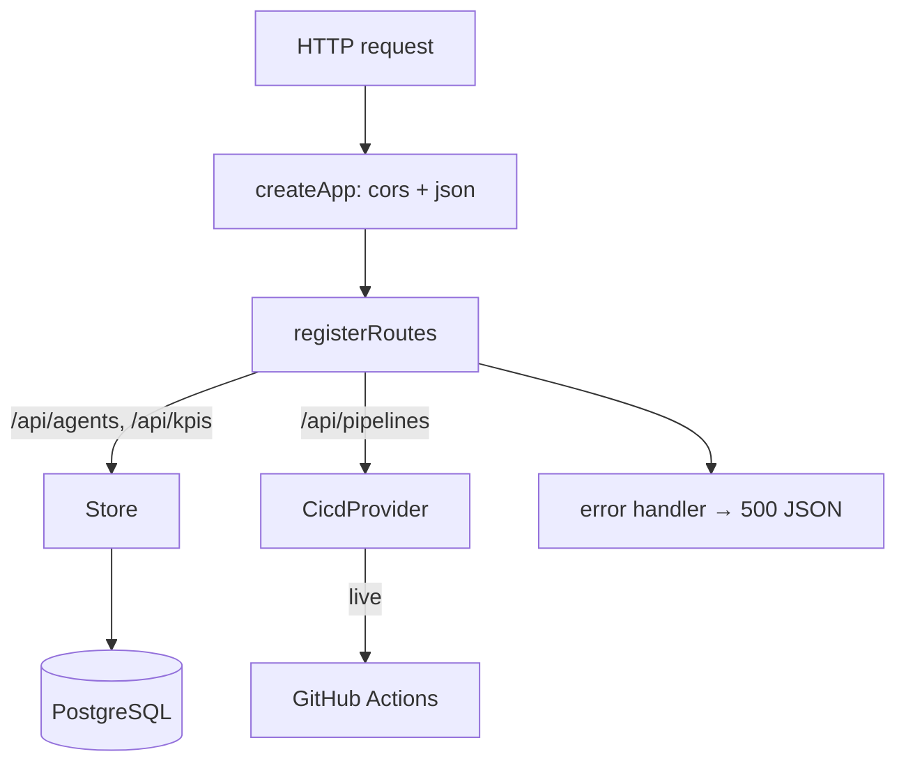

# Backend overview

The backend is a small **Express 5** REST API under `server/`, written in
TypeScript and run with `tsx`. It serves the agent catalogue and KPIs from
PostgreSQL and CI/CD pipeline data through a pluggable integration adapter.

## Stack

- **Express 5** with the `cors` and `express.json()` middleware.
- **TypeScript**, run directly via `tsx` (no separate build step for dev/start).
- **PostgreSQL** via the `pg` `Pool`.
- A **CI/CD integration adapter** — live GitHub Actions, with a deterministic
  mock as the default. See [CI/CD integration](cicd-integration.md).

## Composition root (`src/index.ts`)

`index.ts` is the only place that wires real infrastructure together:

```ts
const pool = new Pool({ connectionString: config.databaseUrl })
const store = createPostgresStore(pool)
const cicd = getCicdProvider({
  githubToken: config.githubToken,
  githubRepo: config.githubRepo,
})
const app = createApp({ store, cicd })
app.listen(config.port, () => { /* logs the URL + active provider */ })
```

It creates a Postgres-backed [store](stores.md), selects a
[CI/CD provider](cicd-integration.md) from config, builds the app, and listens on
`config.port` (default `3001`).

## App assembly (`src/app.ts`)

`createApp(deps)` builds the Express app from injected dependencies:

```ts
interface AppDeps { store: Store; cicd: CicdProvider }
```

It applies `cors()` and `express.json()`, registers the routes
([`registerRoutes`](app-and-routes.md)), and installs a catch-all error handler
that logs the error and responds `500 { error: 'Internal server error' }` so a
throwing route returns JSON rather than crashing.

!!! note "Dependency injection is the testing seam"
    Because `createApp` takes its `store` and `cicd` as arguments, the test suite
    passes an in-memory store and the mock provider — no database, no network.
    See [Testing](testing.md).

## Request flow



## Folder layout

| Path                        | Contents                                             |
| --------------------------- | ---------------------------------------------------- |
| `server/src/index.ts`       | Composition root: pool, store, provider, `listen`.   |
| `server/src/app.ts`         | `createApp(deps)` — middleware, routes, error handler. |
| `server/src/routes.ts`      | REST route registration.                             |
| `server/src/config.ts`      | Env-driven [configuration](configuration.md).        |
| `server/src/domain.ts`      | `Agent` and `Kpi` [domain types](stores.md#domain-types). |
| `server/src/store.ts`       | `Store` interface + in-memory store.                 |
| `server/src/postgresStore.ts` | Postgres-backed store.                             |
| `server/src/seed.ts`        | Seed agents + KPIs.                                  |
| `server/src/integrations/cicd.ts` | The [CI/CD adapter](cicd-integration.md).      |
| `server/src/db/schema.ts`   | SQL DDL.                                              |
| `server/src/db/setup.ts`    | One-shot create-tables + upsert-seed script.         |
| `server/src/__tests__/`     | `api.test.ts`, `cicd.test.ts`.                       |

## Where to go next

- [Configuration](configuration.md) — every environment variable.
- [App & routes](app-and-routes.md) — middleware and each REST route.
- [Data stores](stores.md) — the store interfaces, the two implementations, and
  the domain types.
- [Database](database.md) — schema and the `db:setup` script.
- [CI/CD integration](cicd-integration.md) — the adapter, mock, and live
  provider.
- [Testing](testing.md) — the 12-test suite.
