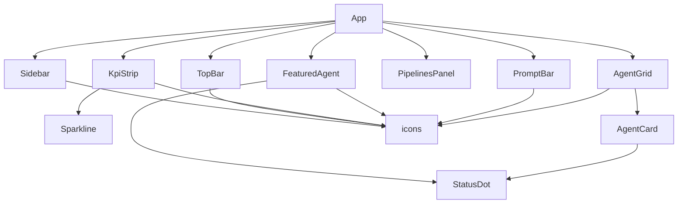

# Components

Every UI component lives in `src/components/`. Components are function
components, default-exported (except the icon set and the shared `STATUS_LABEL`
map), and styled entirely with Tailwind utility classes against the
[design tokens](styling.md).

## Component map



---

## Sidebar

`src/components/Sidebar.tsx` — the fixed left navigation rail (`w-60`, full
height, right border).

**Structure:**

1. **Workspace switcher** — a button showing the "S" mark, "Snabbit / Agent
   Console", and a chevron.
2. **New session** button with a `⌘N` keyboard hint.
3. **Primary nav** — built from the module-level `NAV` array of `NavItem`
   (`{ label, icon, active? }`): Dashboard *(active)*, Sessions, Agents, Runs,
   Integrations, Settings. The active item gets `aria-current="page"`, a filled
   background, and an accent-colored icon.
4. **Recent sessions** — a scrolling list rendered from the `RECENT_SESSIONS`
   string array (e.g. "Fix flaky checkout test", "Q2 dependency sweep").
5. **User footer** — avatar initial, display name `guna`, and email.

!!! note "Static and non-interactive"
    The nav, sessions, and footer are presentational only — none of the buttons
    are wired to navigation or actions yet.

---

## TopBar

`src/components/TopBar.tsx` — the `h-14` header above the main column.

- A breadcrumb: **Agent Console / Overview**.
- A **search button** (`w-72`) with the placeholder "Search agents, runs,
  sessions…" and a `⌘K` hint. Presentational — it does not open a palette
  (tracked in `BACKLOG.md`).
- An **environment selector** showing a green dot and "Production" with a
  chevron.

---

## KpiStrip

`src/components/KpiStrip.tsx` — a responsive grid (`1 / 2 / 4` columns) of KPI
cards, rendered from the `KPIS` array in `src/data/kpis.ts`. The `<section>` is
labelled `aria-label="Key metrics"`.

Each card is the internal `KpiCard` component:

- Shows the `label`, the large `value`, and the `delta`.
- The delta direction icon is chosen by **sign of the delta string**, not by
  `positive`: `kpi.delta.trim().startsWith('-')` picks `IconTrendDown`,
  otherwise `IconTrendUp`.
- The delta **color** is chosen by `positive`: `text-ok` (green) when `true`,
  `text-err` (red) when `false`. So a falling-but-good metric (e.g. mean time to
  merge, `-22%`) renders a down arrow in green.
- Renders a [`Sparkline`](#sparkline) of `kpi.trend`, then the `hint` text.

---

## FeaturedAgent

`src/components/FeaturedAgent.tsx` — the highlighted banner for one agent.

**Props:** `{ agent: Agent }`.

- A decorative diagonal gradient overlay (`--color-accent-subtle` → transparent).
- "Featured agent" eyebrow with a sparkle icon.
- The agent `name` plus a pill containing a [`StatusDot`](#statusdot) and the
  human label from `STATUS_LABEL[agent.status]`.
- The `description`.
- A `<dl>` of four stats via the internal `Stat` component: **Runs · 7d**
  (`runsPerWeek.toLocaleString()`), **Success** (`successRate%`), **Avg run**
  (`avgDuration`), **Last run** (`lastRun`).
- A **Run agent** button (presentational).

---

## PipelinesPanel

`src/components/PipelinesPanel.tsx` — the only component that talks to the
backend. It calls [`useFetch(fetchPipelines)`](lib.md#usefetch) and renders the
result of `GET /api/pipelines`.

**States rendered:**

| Condition                                  | UI                                                              |
| ------------------------------------------ | -------------------------------------------------------------- |
| `loading`                                  | "Loading pipelines…"                                           |
| `error` (and not loading)                  | "Could not reach the API (*message*). Is the server running on port 3001?" |
| `data` present, `pipelines.length === 0`   | "No recent pipeline runs."                                     |
| `data` present, non-empty                  | A divided `<ul>` of `PipelineRow`s                             |

The header shows a summary line when `data` is present —
`{passRate}% pass rate · {running} running · {provider}` — and a **Refresh**
button wired to `reload()` from the fetch hook.

`PipelineRow` renders, per [`Pipeline`](lib.md#pipeline-types): a status dot
colored by `STATUS_STYLES` (`passing`→`bg-ok`, `failing`→`bg-err`,
`running`→`bg-accent`), the `name`, a monospace `branch` chip, a formatted
duration, and the `triggeredBy` actor (hidden on small screens).

The local `formatDuration(seconds)` helper renders `"{m}m {s}s"` when there is at
least one whole minute, otherwise `"{s}s"`.

---

## AgentGrid

`src/components/AgentGrid.tsx` — the searchable, sortable, filterable catalogue.

**Props:** `{ agents: Agent[] }` (the non-featured agents from `App`).

**State:**

| State        | Source                                                    | Persisted? |
| ------------ | --------------------------------------------------------- | ---------- |
| `category`   | `usePersistentState('snabbit.agentGrid.category', 'All')` | ✅ localStorage |
| `sort`       | `usePersistentState('snabbit.agentGrid.sort', 'runs')`    | ✅ localStorage |
| `query`      | `useState('')`                                            | ❌         |
| `selectedId` | `useState<string \| null>(null)`                          | ❌         |

The visible list is memoized:

```tsx
const visible = useMemo(
  () => sortAgents(filterAgents(agents, { query, category }), sort),
  [agents, query, category, sort],
)
```

— filter first (see [`filterAgents`](lib.md#filteragents)), then sort (see
[`sortAgents`](lib.md#sortagents)).

**Controls:**

- **Category tabs** — `['All', 'Popular', ...AGENT_CATEGORIES]`. The active tab
  is tracked with `aria-pressed`. "Popular" matches `agent.popular`; "All"
  matches everything; the rest match the exact category.
- **Sort `<select>`** — labelled "Sort agents", options from `SORT_LABELS`
  (Most runs / Success rate / Name (A–Z) / Recently run).
- **Search input** — labelled "Filter agents", placeholder "Filter agents…".
- The heading shows the current `visible.length`.

When `visible` is empty it renders a dashed empty state: *No agents match "query"*
(or "this filter" when the query is blank). Otherwise it renders a `1 / 2 / 3`
column grid of [`AgentCard`](#agentcard)s, passing `selected` and `onSelect`.

---

## AgentCard

`src/components/AgentCard.tsx` — a single agent tile, rendered as a `<button>`.

**Props:** `{ agent: Agent; selected: boolean; onSelect: (id: string) => void }`.

- Clicking calls `onSelect(agent.id)`; `aria-pressed` reflects `selected`.
- Selected cards get an accent border and ring; unselected cards get a hover
  border/background.
- Shows a [`StatusDot`](#statusdot), the `name` (truncated), and a `category`
  chip; the `description` is clamped to two lines; a monospace footer shows
  `runsPerWeek` runs/wk, `successRate% ok`, and `lastRun`.

---

## PromptBar

`src/components/PromptBar.tsx` — the pinned bottom composer.

- Controlled `<textarea>` (`rows=2`, labelled "Prompt input").
- **Enter** submits; **Shift+Enter** inserts a newline.
- `canSend` is `value.trim().length > 0`; the send button is disabled when
  empty.
- A model selector chip ("Opus 4.7") and a hint ("Enter to send · Shift+Enter
  for newline").

!!! warning "Submit is not wired to the backend"
    `submit()` currently logs the trimmed prompt to the console and clears the
    input. Real backend wiring is tracked in `BACKLOG.md`.

---

## Sparkline

`src/components/Sparkline.tsx` — a tiny, axis-free SVG trend line for KPI cards.

**Props:** `{ points: number[]; positive: boolean; className?: string }`.

- Returns `null` when given **fewer than two points**.
- Maps each value into a `100 × 28` viewBox with `pad = 3`, scaling the y-axis
  across the series' own min/max (`range = max - min || 1`, guarding the
  flat-series divide-by-zero).
- Renders a single `<polyline>` stroked with `var(--color-ok)` when `positive`,
  else `var(--color-err)`, using `vectorEffect="non-scaling-stroke"` so the line
  weight stays constant under `preserveAspectRatio="none"`. Marked
  `aria-hidden`.

---

## StatusDot

`src/components/StatusDot.tsx` — a small colored status indicator. Also exports
the `STATUS_LABEL` map used elsewhere.

**Props:** `{ status: AgentStatus }`.

```ts
export const STATUS_LABEL = {
  running: 'Running',
  idle: 'Idle',
  attention: 'Needs attention',
}
```

- `running` → a pulsing accent (Snabbit pink) dot using an `animate-ping` halo.
- `attention` → a static `bg-warn` (amber) dot.
- `idle` → a static `bg-text-faint` (grey) dot.

Each dot carries a `title` with its human label.

---

## icons

`src/components/icons.tsx` — a dependency-free, 16px, stroke-based icon set drawn
with `currentColor`. A shared `Svg` wrapper sets `viewBox="0 0 16 16"`,
`strokeWidth="1.5"`, round caps/joins, and `aria-hidden`.

Exported icons: `IconDashboard`, `IconSessions`, `IconAgents`, `IconRuns`,
`IconIntegrations`, `IconSettings`, `IconSearch`, `IconPlus`, `IconArrowUp`,
`IconSparkle`, `IconChevronDown`, `IconTrendUp`, `IconTrendDown`. Each accepts
standard `SVGProps<SVGSVGElement>` so callers can pass `className` etc.
