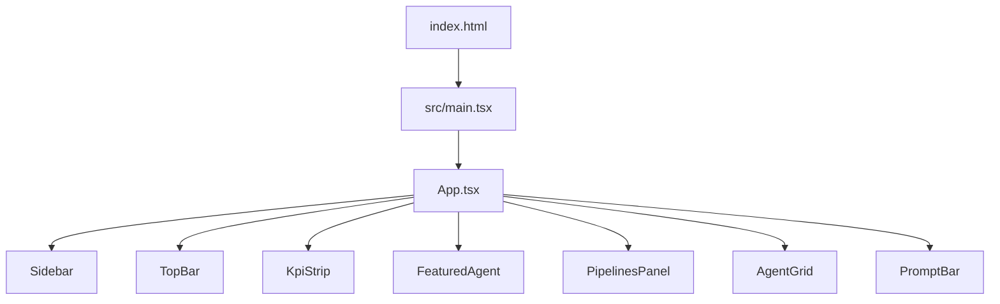

# Frontend overview

The frontend is the Snabbit Agent Console dashboard. It lives at the repository
root and is a Vite-built React 19 single-page app.

## Stack

- **Vite** — dev server and bundler (`vite.config.ts`).
- **React 19** — rendered in `StrictMode`.
- **TypeScript** — strict, project-references build (`tsc -b`).
- **Tailwind CSS v4** — via `@tailwindcss/vite`, configured with design tokens
  in `src/index.css`. See [Styling & design tokens](styling.md).

There is no router and no state-management library; state is local React state
plus a `localStorage`-backed hook for a couple of grid preferences.

## Entry points



- **`index.html`** sets `<html class="dark">`, a pink SVG favicon, the Geist /
  Geist Mono web fonts, and loads `/src/main.tsx` as a module.
- **`src/main.tsx`** creates the React root on `#root` and renders `<App />`
  inside `<StrictMode>`.

## Composition (`src/App.tsx`)

`App` picks the featured agent and renders the shell:

```tsx
const featured = AGENTS.find((a) => a.id === FEATURED_AGENT_ID) ?? AGENTS[0]
const rest = AGENTS.filter((a) => a.id !== featured.id)
```

- `featured` is the agent whose `id` matches `FEATURED_AGENT_ID`
  (`'pr-reviewer'`), falling back to the first agent if it is missing.
- `rest` is every other agent, passed to `AgentGrid` — so the featured agent is
  **not** repeated in the grid.

The layout is a full-height flex row: a fixed-width [Sidebar](components.md#sidebar)
beside a flex column containing the [TopBar](components.md#topbar), a scrolling
`<main>` (max-width `6xl`, gap-5) holding the [KpiStrip](components.md#kpistrip),
[FeaturedAgent](components.md#featuredagent), [PipelinesPanel](components.md#pipelinespanel),
and [AgentGrid](components.md#agentgrid), and a pinned [PromptBar](components.md#promptbar).

## Folder layout

| Folder            | Contents                                              |
| ----------------- | ----------------------------------------------------- |
| `src/`            | `main.tsx`, `App.tsx`, `index.css`, env types         |
| `src/components/` | UI components and their co-located tests              |
| `src/lib/`        | Pure logic (`filterAgents`, `sortAgents`), the API client, and hooks (`useFetch`, `usePersistentState`) |
| `src/data/`       | Local seed data (`agents.ts`, `kpis.ts`) and types    |
| `src/test/`       | Vitest setup (`setup.ts`)                             |

## Data sources

The CI/CD pipelines panel reads live data from the backend through
`src/lib/api.ts`. The agent grid, the featured agent, and the KPIs currently use
local seed data from `src/data/`. See [Data & types](data.md).

## Where to go next

- [Components](components.md) — every component, its props, and behaviour.
- [Library & hooks](lib.md) — the API client, fetch hook, persistence hook, and
  the pure filter/sort helpers.
- [Data & types](data.md) — the `Agent` and `Kpi` shapes and the seed catalogue.
- [Styling & design tokens](styling.md) — the Tailwind theme.
- [Testing](testing.md) — the 37-test suite.
